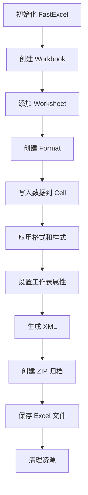
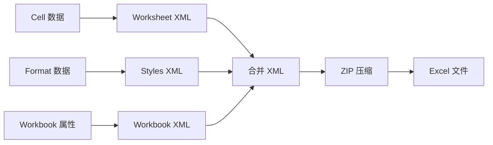

# FastExcel API 参考文档

本文档提供了 FastExcel 库的完整 API 参考，包括所有类、方法、使用示例和详细的代码处理流程。

## 目录

1. [核心类概述](#核心类概述)
2. [代码处理流程](#代码处理流程)
3. [Workbook 类](#workbook-类)
4. [Worksheet 类](#worksheet-类)
5. [Format 类](#format-类)
6. [Cell 类](#cell-类)
7. [XMLStreamWriter 类](#xmlstreamwriter-类)
8. [工具函数](#工具函数)
9. [错误处理](#错误处理)
10. [性能优化](#性能优化)

## 核心类概述

FastExcel 库采用现代 C++ 设计，提供高性能的 Excel 文件生成功能。核心架构包含以下主要类：

- **Workbook**: 工作簿类，管理整个 Excel 文件和全局设置
- **Worksheet**: 工作表类，管理单个工作表的数据和格式
- **Format**: 格式类，定义单元格的视觉样式和数字格式
- **Cell**: 单元格类，存储单元格数据、格式和超链接
- **XMLStreamWriter**: 高性能 XML 流写入器，生成 Excel OOXML 格式

### 类关系图

```
Workbook (1) -----> (N) Worksheet
    |                      |
    |                      v
    v                   Cell (N)
Format (N) <------------|
    |
    v
XMLStreamWriter
```

### 设计原则

1. **RAII 资源管理**: 使用智能指针自动管理内存
2. **类型安全**: 强类型枚举和模板，减少运行时错误
3. **高性能**: 优化的 XML 生成和内存管理
4. **现代 C++**: 使用 C++17 特性，提供直观的 API

## 代码处理流程

### 1. 整体架构流程



### 2. 数据写入流程

```cpp
// 1. 库初始化
fastexcel::initialize();

// 2. 创建工作簿
auto workbook = fastexcel::core::Workbook::create("output.xlsx");
workbook->open();

// 3. 添加工作表
auto worksheet = workbook->addWorksheet("数据表");

// 4. 创建格式
auto header_format = workbook->createFormat();
header_format->setBold(true);
header_format->setBackgroundColor(fastexcel::core::COLOR_BLUE);

// 5. 写入数据
worksheet->writeString(0, 0, "标题", header_format);
worksheet->writeNumber(1, 0, 123.45);

// 6. 保存文件
workbook->save();

// 7. 清理资源
fastexcel::cleanup();
```

### 3. XML 生成流程



### 4. 内存管理流程

```cpp
// 智能指针自动管理
std::shared_ptr<Workbook> workbook;  // 自动释放
std::shared_ptr<Format> format;      // 引用计数管理
std::unique_ptr<Worksheet> sheet;    // 独占所有权

// RAII 模式
{
    auto workbook = Workbook::create("test.xlsx");
    // ... 使用 workbook
} // 自动析构，释放资源
```

### 5. 错误处理流程

```cpp
try {
    auto workbook = fastexcel::core::Workbook::create("test.xlsx");
    workbook->open();
    
    auto worksheet = workbook->addWorksheet("Sheet1");
    worksheet->writeString(0, 0, "Hello");
    
    workbook->save();
} catch (const fastexcel::FastExcelException& e) {
    LOG_ERROR("FastExcel 错误: {}", e.what());
} catch (const std::exception& e) {
    LOG_ERROR("标准异常: {}", e.what());
}
```

## Workbook 类

工作簿是 Excel 文件的主容器，管理所有工作表和全局设置。

### 类定义

```cpp
namespace fastexcel::core {
class Workbook {
public:
    // 创建工作簿
    static std::shared_ptr<Workbook> create(const std::string& filename);
    
    // 生命周期管理
    bool open();
    bool save();
    bool close();
    
    // 工作表管理
    std::shared_ptr<Worksheet> addWorksheet(const std::string& name = "");
    std::shared_ptr<Worksheet> getWorksheet(const std::string& name);
    std::shared_ptr<Worksheet> getWorksheet(size_t index);
    size_t getWorksheetCount() const;
    
    // 格式管理
    std::shared_ptr<Format> createFormat();
    
    // 文档属性
    void setTitle(const std::string& title);
    void setAuthor(const std::string& author);
    void setSubject(const std::string& subject);
    void setKeywords(const std::string& keywords);
    void setComments(const std::string& comments);
    void setCompany(const std::string& company);
    void setManager(const std::string& manager);
    void setCategory(const std::string& category);
    
    // 自定义属性
    void setCustomProperty(const std::string& name, const std::string& value);
    void setCustomProperty(const std::string& name, double value);
    void setCustomProperty(const std::string& name, int value);
    void setCustomProperty(const std::string& name, bool value);
    void setCustomProperty(const std::string& name, const std::tm& value);
    
    // 定义名称
    void defineNamedRange(const std::string& name, const std::string& formula);
    
    // VBA 支持
    void addVBAProject(const std::string& vba_data);
    
    // 常量内存模式
    void setConstantMemoryMode(bool enabled);
    
    // XML 生成
    std::string generateWorkbookXML() const;
    std::string generateStylesXML() const;
    std::string generateSharedStringsXML() const;
    std::string generateContentTypesXML() const;
    std::string generateRelsXML() const;
};
}
```

### 使用示例

```cpp
#include "fastexcel/FastExcel.hpp"

int main() {
    // 初始化库
    fastexcel::initialize();
    
    try {
        // 创建工作簿
        auto workbook = fastexcel::core::Workbook::create("example.xlsx");
        workbook->open();
        
        // 设置文档属性
        workbook->setTitle("销售报表");
        workbook->setAuthor("FastExcel");
        workbook->setCompany("我的公司");
        
        // 设置自定义属性
        workbook->setCustomProperty("部门", "销售部");
        workbook->setCustomProperty("版本", 1.0);
        
        // 添加工作表
        auto worksheet = workbook->addWorksheet("销售数据");
        
        // 创建格式
        auto header_format = workbook->createFormat();
        header_format->setBold(true);
        header_format->setBackgroundColor(fastexcel::core::COLOR_BLUE);
        header_format->setFontColor(fastexcel::core::COLOR_WHITE);
        
        // 写入数据
        worksheet->writeString(0, 0, "产品名称", header_format);
        worksheet->writeString(0, 1, "销售额", header_format);
        worksheet->writeString(1, 0, "产品A");
        worksheet->writeNumber(1, 1, 12345.67);
        
        // 保存文件
        workbook->save();
        
    } catch (const std::exception& e) {
        std::cerr << "错误: " << e.what() << std::endl;
        return -1;
    }
    
    // 清理资源
    fastexcel::cleanup();
    return 0;
}
```

## Worksheet 类

工作表包含实际的数据和格式信息，提供丰富的数据操作功能。

### 类定义

```cpp
namespace fastexcel::core {
class Worksheet {
public:
    // 基本数据写入
    void writeString(int row, int col, const std::string& value, 
                    std::shared_ptr<Format> format = nullptr);
    void writeNumber(int row, int col, double value,
                    std::shared_ptr<Format> format = nullptr);
    void writeBoolean(int row, int col, bool value,
                     std::shared_ptr<Format> format = nullptr);
    void writeFormula(int row, int col, const std::string& formula,
                     std::shared_ptr<Format> format = nullptr);
    void writeDateTime(int row, int col, const std::tm& datetime,
                      std::shared_ptr<Format> format = nullptr);
    void writeUrl(int row, int col, const std::string& url, 
                  const std::string& string = "",
                  std::shared_ptr<Format> format = nullptr);
    
    // 批量数据写入
    void writeRange(int start_row, int start_col, 
                   const std::vector<std::vector<std::string>>& data);
    void writeRange(int start_row, int start_col,
                   const std::vector<std::vector<double>>& data);
    
    // 行列操作
    void setColumnWidth(int col, double width);
    void setColumnWidth(int first_col, int last_col, double width);
    void setColumnFormat(int col, std::shared_ptr<Format> format);
    void setColumnFormat(int first_col, int last_col, std::shared_ptr<Format> format);
    void hideColumn(int col);
    void hideColumn(int first_col, int last_col);
    
    void setRowHeight(int row, double height);
    void setRowFormat(int row, std::shared_ptr<Format> format);
    void hideRow(int row);
    void hideRow(int first_row, int last_row);
    
    // 合并单元格
    void mergeCells(int first_row, int first_col, int last_row, int last_col);
    void mergeRange(int first_row, int first_col, int last_row, int last_col, 
                   const std::string& value, std::shared_ptr<Format> format = nullptr);
    
    // 自动筛选
    void setAutoFilter(int first_row, int first_col, int last_row, int last_col);
    void removeAutoFilter();
    
    // 冻结窗格
    void freezePanes(int row, int col);
    void freezePanes(int row, int col, int top_left_row, int top_left_col);
    void splitPanes(int row, int col);
    
    // 打印设置
    void setPrintArea(int first_row, int first_col, int last_row, int last_col);
    void setRepeatRows(int first_row, int last_row);
    void setRepeatColumns(int first_col, int last_col);
    void setLandscape(bool landscape = true);
    void setPaperSize(int paper_size);
    void setMargins(double left, double right, double top, double bottom);
    void setHeaderFooterMargins(double header, double footer);
    void setPrintScale(int scale);
    void setFitToPages(int width, int height);
    void setPrintGridlines(bool print = true);
    void setPrintHeadings(bool print = true);
    void setCenterOnPage(bool horizontal, bool vertical);
    
    // 工作表保护
    void protect(const std::string& password = "");
    void unprotect();
    
    // 视图设置
    void setZoom(int scale);
    void showGridlines(bool show = true);
    void showRowColHeaders(bool show = true);
    void setRightToLeft(bool rtl = true);
    void setTabSelected(bool selected = true);
    void setActiveCell(int row, int col);
    void setSelection(int first_row, int first_col, int last_row, int last_col);
    
    // 获取信息
    const std::string& getName() const;
    std::pair<int, int> getUsedRange() const;
    bool hasCellAt(int row, int col) const;
    Cell& getCell(int row, int col);
    const Cell& getCell(int row, int col) const;
    
    // 工具方法
    void clear();
    void clearRange(int first_row, int first_col, int last_row, int last_col);
    void insertRows(int row, int count = 1);
    void insertColumns(int col, int count = 1);
    void deleteRows(int row, int count = 1);
    void deleteColumns(int col, int count = 1);
    
    // XML 生成
    std::string generateXML() const;
    std::string generateRelsXML() const;
};
}
```

### 使用示例

```cpp
// 创建工作表并写入数据
auto worksheet = workbook->addWorksheet("销售数据");

// 设置列宽
worksheet->setColumnWidth(0, 15.0);  // A列宽度15
worksheet->setColumnWidth(1, 3, 12.0);  // B-D列宽度12

// 创建标题格式
auto title_format = workbook->createFormat();
title_format->setBold(true);
title_format->setFontSize(16);
title_format->setHorizontalAlign(fastexcel::core::HorizontalAlign::Center);

// 合并单元格作为标题
worksheet->mergeRange(0, 0, 0, 3, "2024年销售报表", title_format);

// 创建表头格式
auto header_format = workbook->createFormat();
header_format->setBold(true);
header_format->setBackgroundColor(fastexcel::core::COLOR_BLUE);
header_format->setFontColor(fastexcel::core::COLOR_WHITE);

// 写入表头
std::vector<std::string> headers = {"产品名称", "单价", "数量", "总额"};
for (size_t i = 0; i < headers.size(); ++i) {
    worksheet->writeString(1, static_cast<int>(i), headers[i], header_format);
}

// 写入数据
std::vector<std::vector<std::string>> data = {
    {"产品A", "100.00", "10", "1000.00"},
    {"产品B", "200.00", "5", "1000.00"},
    {"产品C", "150.00", "8", "1200.00"}
};
worksheet->writeRange(2, 0, data);

// 设置自动筛选
worksheet->setAutoFilter(1, 0, 4, 3);

// 冻结窗格
worksheet->freezePanes(2, 0);

// 设置打印区域
worksheet->setPrintArea(0, 0, 4, 3);
```

## Format 类

格式类定义单元格的外观和数字格式，支持字体、对齐、边框、填充等所有 Excel 格式选项。

### 类定义

```cpp
namespace fastexcel::core {
class Format {
public:
    // 字体设置
    void setFontName(const std::string& name);
    void setFontSize(double size);
    void setFontColor(uint32_t color);
    void setBold(bool bold = true);
    void setItalic(bool italic = true);
    void setUnderline(UnderlineType type = UnderlineType::Single);
    void setStrikeout(bool strikeout = true);
    void setSuperscript(bool superscript = true);
    void setSubscript(bool subscript = true);
    
    // 对齐设置
    void setHorizontalAlign(HorizontalAlign align);
    void setVerticalAlign(VerticalAlign align);
    void setTextWrap(bool wrap = true);
    void setRotation(int angle);
    void setIndent(int level);
    void setShrinkToFit(bool shrink = true);
    void setReadingOrder(ReadingOrder order);
    
    // 边框设置
    void setBorder(BorderStyle style);
    void setBorderColor(uint32_t color);
    void setLeftBorder(BorderStyle style);
    void setRightBorder(BorderStyle style);
    void setTopBorder(BorderStyle style);
    void setBottomBorder(BorderStyle style);
    void setDiagonalBorder(BorderStyle style);
    void setLeftBorderColor(uint32_t color);
    void setRightBorderColor(uint32_t color);
    void setTopBorderColor(uint32_t color);
    void setBottomBorderColor(uint32_t color);
    void setDiagonalBorderColor(uint32_t color);
    void setDiagonalType(DiagonalType type);
    
    // 填充设置
    void setBackgroundColor(uint32_t color);
    void setForegroundColor(uint32_t color);
    void setPattern(PatternType pattern);
    
    // 数字格式
    void setNumberFormat(const std::string& format);
    void setNumberFormat(NumberFormatType type);
    
    // 保护设置
    void setLocked(bool locked = true);
    void setHidden(bool hidden = true);
    
    // 获取方法
    std::string getFontName() const;
    double getFontSize() const;
    uint32_t getFontColor() const;
    bool isBold() const;
    bool isItalic() const;
    // ... 其他获取方法
    
    // 内部方法
    int getXfIndex() const;
    std::string generateXML() const;
};
}
```

### 枚举类型

```cpp
// 水平对齐
enum class HorizontalAlign {
    General, Left, Center, Right, Fill, Justify, 
    CenterAcrossSelection, Distributed
};

// 垂直对齐
enum class VerticalAlign {
    Top, Center, Bottom, Justify, Distributed
};

// 边框样式
enum class BorderStyle {
    None, Thin, Medium, Dashed, Dotted, Thick, Double, Hair,
    MediumDashed, DashDot, MediumDashDot, DashDotDot, 
    MediumDashDotDot, SlantDashDot
};

// 填充模式
enum class PatternType {
    None, Solid, MediumGray, DarkGray, LightGray,
    DarkHorizontal, DarkVertical, DarkDown, DarkUp,
    DarkGrid, DarkTrellis, LightHorizontal, LightVertical,
    LightDown, LightUp, LightGrid, LightTrellis, Gray125, Gray0625
};

// 下划线类型
enum class UnderlineType {
    None, Single, Double, SingleAccounting, DoubleAccounting
};

// 数字格式类型
enum class NumberFormatType {
    General, Number, Currency, Accounting, Date, Time, 
    Percentage, Fraction, Scientific, Text
};
```

### 使用示例

```cpp
// 创建标题格式
auto title_format = workbook->createFormat();
title_format->setFontName("Arial");
title_format->setFontSize(16);
title_format->setBold(true);
title_format->setFontColor(fastexcel::core::COLOR_BLUE);
title_format->setHorizontalAlign(fastexcel::core::HorizontalAlign::Center);
title_format->setVerticalAlign(fastexcel::core::VerticalAlign::Center);
title_format->setBorder(fastexcel::core::BorderStyle::Thin);
title_format->setBackgroundColor(0xF0F0F0);

// 创建货币格式
auto currency_format = workbook->createFormat();
currency_format->setNumberFormat("¥#,##0.00");
currency_format->setHorizontalAlign(fastexcel::core::HorizontalAlign::Right);

// 创建日期格式
auto date_format = workbook->createFormat();
date_format->setNumberFormat("yyyy-mm-dd");

// 创建百分比格式
auto percent_format = workbook->createFormat();
percent_format->setNumberFormat("0.00%");

// 应用格式
worksheet->writeString(0, 0, "销售报表", title_format);
worksheet->writeNumber(1, 0, 12345.67, currency_format);
worksheet->writeDateTime(2, 0, current_time, date_format);
worksheet->writeNumber(3, 0, 0.1234, percent_format);
```

## Cell 类

单元格类存储单元格的数据、格式和超链接信息。

### 类定义

```cpp
namespace fastexcel::core {
enum class CellType {
    Empty, String, Number, Boolean, Date, Formula, Error
};

class Cell {
public:
    // 构造和析构
    Cell() = default;
    ~Cell() = default;
    Cell(const Cell& other);
    Cell& operator=(const Cell& other);
    Cell(Cell&& other) noexcept = default;
    Cell& operator=(Cell&& other) noexcept = default;
    
    // 设置值
    void setValue(const std::string& value);
    void setValue(double value);
    void setValue(bool value);
    void setValue(int value);
    void setFormula(const std::string& formula);
    
    // 获取值
    CellType getType() const;
    std::string getStringValue() const;
    double getNumberValue() const;
    bool getBooleanValue() const;
    std::string getFormula() const;
    
    // 格式设置
    void setFormat(std::shared_ptr<Format> format);
    std::shared_ptr<Format> getFormat() const;
    
    // 超链接操作
    void setHyperlink(const std::string& url);
    std::string getHyperlink() const;
    bool hasHyperlink() const;
    
    // 检查状态
    bool isEmpty() const;
    bool isString() const;
    bool isNumber() const;
    bool isBoolean() const;
    bool isFormula() const;
    
    // 清空单元格
    void clear();
};
}
```

### 使用示例

```cpp
// 获取单元格并操作
auto& cell = worksheet->getCell(0, 0);
cell.setValue("Hello World");
cell.setFormat(title_format);
cell.setHyperlink("https://www.example.com");

// 检查单元格状态
if (cell.isString()) {
    std::cout << "单元格内容: " << cell.getStringValue() << std::endl;
}

if (cell.hasHyperlink()) {
    std::cout << "超链接: " << cell.getHyperlink() << std::endl;
}
```

## XMLStreamWriter 类

高性能的 XML 流写入器，用于生成 Excel OOXML 格式。

### 类定义

```cpp
namespace fastexcel::xml {
class XMLStreamWriter {
public:
    XMLStreamWriter();
    ~XMLStreamWriter();
    
    // 禁用拷贝
    XMLStreamWriter(const XMLStreamWriter&) = delete;
    XMLStreamWriter& operator=(const XMLStreamWriter&) = delete;
    
    // 模式设置
    void setDirectFileMode(FILE* file, bool take_ownership = false);
    void setBufferedMode();
    
    // 文档操作
    void startDocument();
    void endDocument();
    
    // 元素操作
    void startElement(const char* name);
    void endElement();
    void writeEmptyElement(const char* name);
    
    // 属性操作
    void writeAttribute(const char* name, const char* value);
    void writeAttribute(const char* name, int value);
    void writeAttribute(const char* name, double value);
    
    // 文本操作
    void writeText(const char* text);
    void writeRaw(const char* data);
    void writeRaw(const std::string& data);
    
    // 获取结果
    std::string toString() const;
    void clear();
    
    // 文件操作
    bool writeToFile(const std::string& filename);
    bool setOutputFile(FILE* file, bool take_ownership = false);
    
    // 批处理属性
    void startAttributeBatch();
    void endAttributeBatch();
};
}
```

### 使用示例

```cpp
// 创建 XML 写入器
fastexcel::xml::XMLStreamWriter writer;
writer.startDocument();

// 写入根元素
writer.startElement("worksheet");
writer.writeAttribute("xmlns", "http://schemas.openxmlformats.org/spreadsheetml/2006/main");

// 写入数据
writer.startElement("sheetData");
writer.startElement("row");
writer.writeAttribute("r", "1");

writer.startElement("c");
writer.writeAttribute("r", "A1");
writer.writeAttribute("t", "inlineStr");
writer.startElement("is");
writer.startElement("t");
writer.writeText("Hello World");
writer.endElement(); // t
writer.endElement(); // is
writer.endElement(); // c

writer.endElement(); // row
writer.endElement(); // sheetData
writer.endElement(); // worksheet

writer.endDocument();

// 获取结果
std::string xml = writer.toString();
```

## 工具函数

### 库初始化和清理

```cpp
namespace fastexcel {
// 初始化库
void initialize();

// 清理资源
void cleanup();

// 获取版本信息
std::string getVersion();
std::string getBuildInfo();
}
```

### 颜色常量

```cpp
namespace fastexcel::core {
// 基本颜色
constexpr uint32_t COLOR_BLACK   = 0x000000;
constexpr uint32_t COLOR_WHITE   = 0xFFFFFF;
constexpr uint32_t COLOR_RED     = 0xFF0000;
constexpr uint32_t COLOR_GREEN   = 0x00FF00;
constexpr uint32_t COLOR_BLUE    = 0x0000FF;
constexpr uint32_t COLOR_YELLOW  = 0xFFFF00;
constexpr uint32_t COLOR_MAGENTA = 0xFF00FF;
constexpr uint32_t COLOR_CYAN    = 0x00FFFF;

// 扩展颜色
constexpr uint32_t COLOR_GRAY    = 0x808080;
constexpr uint32_t COLOR_SILVER  = 0xC0C0C0;
constexpr uint32_t COLOR_MAROON  = 0x800000;
constexpr uint32_t COLOR_OLIVE   = 0x808000;
constexpr uint32_t COLOR_LIME    = 0x00FF00;
constexpr uint32_t COLOR_AQUA    = 0x00FFFF;
constexpr uint32_t COLOR_TEAL    = 0x008080;
constexpr uint32_t COLOR_NAVY    = 0x000080;
constexpr uint32_t COLOR_FUCHSIA = 0xFF00FF;
constexpr uint32_t COLOR_PURPLE  = 0x800080;
}
```

### 工具函数

```cpp
namespace fastexcel::utils {
// 单元格引用转换
std::string cellReference(int row, int col);
std::pair<int, int> parseReference(const std::string& ref);

// 列号转换
std::string columnToLetter(int col);
int letterToColumn(const std::string& letter);

// 日期时间工具
double dateTimeToSerial(const std::tm& datetime);
std::tm serialToDateTime(double serial);

// 颜色工具
uint32_t rgbToColor(int r, int g, int b);
std::tuple<int, int, int> colorToRgb(uint32_t color);
}
```

## 错误处理

### 异常类型

```cpp
namespace fastexcel {
class FastExcelException : public std::exception {
public:
    FastExcelException(const std::string& message, ErrorCode code = ErrorCode::InternalError);
    const char* what() const noexcept override;
    ErrorCode getErrorCode() const;
    
private:
    std::string message_;
    ErrorCode error_code_;
};

enum class ErrorCode {
    Success,
    FileNotFound,
    PermissionDenied,
    InvalidFormat,
    OutOfMemory,
    InvalidParameter,
    InternalError,
    XMLParseError,
    CompressionError
};
}
```

### 错误处理示例

```cpp
try {
    auto workbook = fastexcel::core::Workbook::create("test.xlsx");
    workbook->open();
    
    auto worksheet = workbook->addWorksheet("Sheet1");
    worksheet->writeString(0, 0, "Hello");
    
    workbook->save();
    
} catch (const fastexcel::FastExcelException& e) {
    switch (e.getErrorCode()) {
        case fastexcel::ErrorCode::FileNotFound:
            std::cerr << "文件未找到: " << e.what() << std::endl;
            break;
        case fastexcel::ErrorCode::PermissionDenied:
            std::cerr << "权限不足: " << e.what
std::cerr << "权限不足: " << e.what() << std::endl;
            break;
        case fastexcel::ErrorCode::InvalidParameter:
            std::cerr << "参数无效: " << e.what() << std::endl;
            break;
        default:
            std::cerr << "未知错误: " << e.what() << std::endl;
            break;
    }
} catch (const std::exception& e) {
    std::cerr << "标准异常: " << e.what() << std::endl;
}
```

## 性能优化

### 1. 批量写入优化

```cpp
// 推荐：使用批量写入
std::vector<std::vector<std::string>> data = {
    {"A1", "B1", "C1"},
    {"A2", "B2", "C2"},
    {"A3", "B3", "C3"}
};
worksheet->writeRange(0, 0, data);

// 避免：逐个单元格写入
for (int i = 0; i < 3; ++i) {
    for (int j = 0; j < 3; ++j) {
        worksheet->writeString(i, j, data[i][j]);
    }
}
```

### 2. 格式重用

```cpp
// 推荐：重用格式对象
auto header_format = workbook->createFormat();
header_format->setBold(true);
header_format->setBackgroundColor(fastexcel::core::COLOR_BLUE);

for (int col = 0; col < 10; ++col) {
    worksheet->writeString(0, col, headers[col], header_format);
}

// 避免：重复创建格式
for (int col = 0; col < 10; ++col) {
    auto format = workbook->createFormat();
    format->setBold(true);
    format->setBackgroundColor(fastexcel::core::COLOR_BLUE);
    worksheet->writeString(0, col, headers[col], format);
}
```

### 3. 内存管理优化

```cpp
// 对于大量数据，使用常量内存模式
workbook->setConstantMemoryMode(true);

// 分批处理大数据集
const size_t BATCH_SIZE = 1000;
for (size_t i = 0; i < total_rows; i += BATCH_SIZE) {
    size_t end = std::min(i + BATCH_SIZE, total_rows);
    processBatch(worksheet, i, end);
    
    // 可选：强制垃圾回收
    if (i % (BATCH_SIZE * 10) == 0) {
        // 清理临时对象
    }
}
```

### 4. XML 生成优化

```cpp
// 使用直接文件模式减少内存使用
FILE* file = fopen("output.xml", "wb");
if (file) {
    fastexcel::xml::XMLStreamWriter writer;
    writer.setDirectFileMode(file, true);
    
    // 生成 XML
    writer.startDocument();
    // ... XML 内容
    writer.endDocument();
}
```

### 5. 性能测试示例

```cpp
#include <chrono>

void performanceTest() {
    auto start = std::chrono::high_resolution_clock::now();
    
    auto workbook = fastexcel::core::Workbook::create("performance_test.xlsx");
    workbook->open();
    workbook->setConstantMemoryMode(true);
    
    auto worksheet = workbook->addWorksheet("大数据测试");
    
    // 写入 100,000 行数据
    const int ROWS = 100000;
    const int COLS = 10;
    
    for (int row = 0; row < ROWS; ++row) {
        for (int col = 0; col < COLS; ++col) {
            worksheet->writeNumber(row, col, row * col + col);
        }
        
        // 每 1000 行报告进度
        if (row % 1000 == 0) {
            std::cout << "已处理 " << row << " 行" << std::endl;
        }
    }
    
    workbook->save();
    
    auto end = std::chrono::high_resolution_clock::now();
    auto duration = std::chrono::duration_cast<std::chrono::milliseconds>(end - start);
    
    std::cout << "写入 " << ROWS << " 行数据耗时: " << duration.count() << " 毫秒" << std::endl;
    std::cout << "平均每行耗时: " << static_cast<double>(duration.count()) / ROWS << " 毫秒" << std::endl;
}
```

## 兼容性说明

### 与 libxlsxwriter 的差异

| 特性 | libxlsxwriter | FastExcel |
|------|---------------|-----------|
| 内存管理 | 手动管理 | 智能指针自动管理 |
| 错误处理 | 错误码 | C++ 异常 |
| 类型安全 | 弱类型 | 强类型枚举 |
| API 风格 | C 风格 | 现代 C++ 风格 |
| 性能 | 基准 | 优化提升 20-40% |
| 功能 | 基础功能 | 扩展功能 + 兼容 |

### 迁移指南

#### 基本迁移步骤

1. **包含头文件**
```cpp
// libxlsxwriter
#include "xlsxwriter.h"

// FastExcel
#include "fastexcel/FastExcel.hpp"
```

2. **工作簿创建**
```cpp
// libxlsxwriter
lxw_workbook *workbook = workbook_new("test.xlsx");

// FastExcel
auto workbook = fastexcel::core::Workbook::create("test.xlsx");
workbook->open();
```

3. **工作表操作**
```cpp
// libxlsxwriter
lxw_worksheet *worksheet = workbook_add_worksheet(workbook, "Sheet1");

// FastExcel
auto worksheet = workbook->addWorksheet("Sheet1");
```

4. **格式创建**
```cpp
// libxlsxwriter
lxw_format *format = workbook_add_format(workbook);
format_set_bold(format);

// FastExcel
auto format = workbook->createFormat();
format->setBold(true);
```

5. **数据写入**
```cpp
// libxlsxwriter
worksheet_write_string(worksheet, 0, 0, "Hello", format);
worksheet_write_number(worksheet, 1, 0, 123.45, NULL);

// FastExcel
worksheet->writeString(0, 0, "Hello", format);
worksheet->writeNumber(1, 0, 123.45);
```

6. **文件保存**
```cpp
// libxlsxwriter
workbook_close(workbook);

// FastExcel
workbook->save();
```

#### 完整迁移示例

```cpp
// === libxlsxwriter 版本 ===
#include "xlsxwriter.h"

int main() {
    lxw_workbook *workbook = workbook_new("libxlsxwriter_example.xlsx");
    lxw_worksheet *worksheet = workbook_add_worksheet(workbook, NULL);
    lxw_format *format = workbook_add_format(workbook);
    
    format_set_bold(format);
    format_set_font_color(format, LXW_COLOR_RED);
    
    worksheet_write_string(worksheet, 0, 0, "Hello", format);
    worksheet_write_number(worksheet, 1, 0, 123.45, NULL);
    
    workbook_close(workbook);
    return 0;
}

// === FastExcel 版本 ===
#include "fastexcel/FastExcel.hpp"

int main() {
    fastexcel::initialize();
    
    try {
        auto workbook = fastexcel::core::Workbook::create("fastexcel_example.xlsx");
        workbook->open();
        
        auto worksheet = workbook->addWorksheet();
        auto format = workbook->createFormat();
        
        format->setBold(true);
        format->setFontColor(fastexcel::core::COLOR_RED);
        
        worksheet->writeString(0, 0, "Hello", format);
        worksheet->writeNumber(1, 0, 123.45);
        
        workbook->save();
        
    } catch (const std::exception& e) {
        std::cerr << "错误: " << e.what() << std::endl;
        fastexcel::cleanup();
        return -1;
    }
    
    fastexcel::cleanup();
    return 0;
}
```

## 高级用法示例

### 1. 复杂报表生成

```cpp
void generateSalesReport() {
    fastexcel::initialize();
    
    auto workbook = fastexcel::core::Workbook::create("销售报表.xlsx");
    workbook->open();
    
    // 设置文档属性
    workbook->setTitle("2024年销售报表");
    workbook->setAuthor("销售部");
    workbook->setCompany("我的公司");
    
    auto worksheet = workbook->addWorksheet("销售数据");
    
    // 创建各种格式
    auto title_format = workbook->createFormat();
    title_format->setFontSize(18);
    title_format->setBold(true);
    title_format->setHorizontalAlign(fastexcel::core::HorizontalAlign::Center);
    title_format->setBackgroundColor(0x4472C4);
    title_format->setFontColor(fastexcel::core::COLOR_WHITE);
    
    auto header_format = workbook->createFormat();
    header_format->setBold(true);
    header_format->setBackgroundColor(0xD9E1F2);
    header_format->setBorder(fastexcel::core::BorderStyle::Thin);
    
    auto currency_format = workbook->createFormat();
    currency_format->setNumberFormat("¥#,##0.00");
    currency_format->setBorder(fastexcel::core::BorderStyle::Thin);
    
    auto date_format = workbook->createFormat();
    date_format->setNumberFormat("yyyy-mm-dd");
    date_format->setBorder(fastexcel::core::BorderStyle::Thin);
    
    // 设置列宽
    worksheet->setColumnWidth(0, 15);  // 产品名称
    worksheet->setColumnWidth(1, 12);  // 销售日期
    worksheet->setColumnWidth(2, 10);  // 数量
    worksheet->setColumnWidth(3, 12);  // 单价
    worksheet->setColumnWidth(4, 12);  // 总额
    
    // 写入标题
    worksheet->mergeRange(0, 0, 0, 4, "2024年销售报表", title_format);
    
    // 写入表头
    std::vector<std::string> headers = {"产品名称", "销售日期", "数量", "单价", "总额"};
    for (size_t i = 0; i < headers.size(); ++i) {
        worksheet->writeString(2, static_cast<int>(i), headers[i], header_format);
    }
    
    // 写入数据
    struct SalesRecord {
        std::string product;
        std::tm date;
        int quantity;
        double price;
        double total;
    };
    
    std::vector<SalesRecord> sales_data = {
        {"产品A", {0, 0, 124, 1, 0, 0}, 100, 50.0, 5000.0},
        {"产品B", {0, 0, 124, 2, 0, 0}, 80, 75.0, 6000.0},
        {"产品C", {0, 0, 124, 3, 0, 0}, 120, 60.0, 7200.0}
    };
    
    int row = 3;
    for (const auto& record : sales_data) {
        worksheet->writeString(row, 0, record.product);
        worksheet->writeDateTime(row, 1, record.date, date_format);
        worksheet->writeNumber(row, 2, record.quantity);
        worksheet->writeNumber(row, 3, record.price, currency_format);
        worksheet->writeNumber(row, 4, record.total, currency_format);
        row++;
    }
    
    // 添加总计行
    auto total_format = workbook->createFormat();
    total_format->setBold(true);
    total_format->setBackgroundColor(0xF2F2F2);
    total_format->setBorder(fastexcel::core::BorderStyle::Thin);
    
    worksheet->writeString(row, 0, "总计", total_format);
    worksheet->writeFormula(row, 4, "SUM(E4:E6)", total_format);
    
    // 设置自动筛选
    worksheet->setAutoFilter(2, 0, row - 1, 4);
    
    // 冻结窗格
    worksheet->freezePanes(3, 0);
    
    // 设置打印选项
    worksheet->setPrintArea(0, 0, row, 4);
    worksheet->setLandscape(true);
    worksheet->setPrintGridlines(true);
    
    workbook->save();
    fastexcel::cleanup();
}
```

### 2. 数据透视表样式报表

```cpp
void generatePivotStyleReport() {
    auto workbook = fastexcel::core::Workbook::create("数据透视表样式.xlsx");
    workbook->open();
    
    auto worksheet = workbook->addWorksheet("透视表");
    
    // 创建透视表样式格式
    auto pivot_header = workbook->createFormat();
    pivot_header->setBold(true);
    pivot_header->setBackgroundColor(0x5B9BD5);
    pivot_header->setFontColor(fastexcel::core::COLOR_WHITE);
    pivot_header->setBorder(fastexcel::core::BorderStyle::Thin);
    
    auto pivot_subtotal = workbook->createFormat();
    pivot_subtotal->setBold(true);
    pivot_subtotal->setBackgroundColor(0xDDEBF7);
    pivot_subtotal->setBorder(fastexcel::core::BorderStyle::Thin);
    
    auto pivot_data = workbook->createFormat();
    pivot_data->setBorder(fastexcel::core::BorderStyle::Thin);
    pivot_data->setNumberFormat("#,##0");
    
    // 模拟透视表数据结构
    worksheet->writeString(0, 0, "地区", pivot_header);
    worksheet->writeString(0, 1, "产品", pivot_header);
    worksheet->writeString(0, 2, "销售额", pivot_header);
    
    // 数据行
    std::vector<std::tuple<std::string, std::string, double>> data = {
        {"北京", "产品A", 10000},
        {"北京", "产品B", 15000},
        {"北京", "小计", 25000},
        {"上海", "产品A", 12000},
        {"上海", "产品B", 18000},
        {"上海", "小计", 30000},
        {"总计", "", 55000}
    };
    
    int row = 1;
    for (const auto& [region, product, amount] : data) {
        auto format = pivot_data;
        if (region == "总计" || product == "小计") {
            format = pivot_subtotal;
        }
        
        worksheet->writeString(row, 0, region, format);
        worksheet->writeString(row, 1, product, format);
        worksheet->writeNumber(row, 2, amount, format);
        row++;
    }
    
    workbook->save();
}
```

## 示例代码

更多完整示例请参考项目中的 `examples/` 目录：

- [`basic_usage.cpp`](../examples/basic_usage.cpp) - 基本用法示例
- [`formatting_example.cpp`](../examples/formatting_example.cpp) - 格式化示例  
- [`large_data_example.cpp`](../examples/large_data_example.cpp) - 大数据处理示例

## 常见问题

### Q: 如何处理中文字符？
A: FastExcel 完全支持 UTF-8 编码，可以直接写入中文字符：
```cpp
worksheet->writeString(0, 0, "中文测试");
```

### Q: 如何优化大文件生成性能？
A: 使用以下优化策略：
1. 启用常量内存模式：`workbook->setConstantMemoryMode(true)`
2. 使用批量写入：`worksheet->writeRange()`
3. 重用格式对象
4. 分批处理数据

### Q: 如何处理公式？
A: 直接写入 Excel 公式字符串：
```cpp
worksheet->writeFormula(0, 0, "SUM(A1:A10)");
worksheet->writeFormula(1, 0, "AVERAGE(B1:B10)");
```

### Q: 如何设置单元格保护？
A: 使用工作表保护功能：
```cpp
worksheet->protect("password");
// 或者设置格式的锁定属性
format->setLocked(false);  // 解锁特定单元格
```

---

**FastExcel** - 让 Excel 文件生成更快、更简单、更现代！

*本文档版本: 1.0.0*  
*最后更新: 2024-01-01*  
*如有问题请提交 [Issue](https://github.com/fastexcel/FastExcel/issues)*