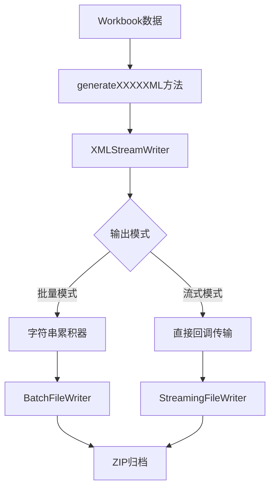

# FastExcel 项目架构分析

## 概述

FastExcel是一个高性能的C++ Excel文件处理库，采用现代C++17设计，提供完整的Excel文件生成和处理功能。项目采用分层架构和模块化设计，通过智能流式处理和格式去重技术，实现了从小文件到大文件的全场景高性能处理。

## 整体架构

### 1. 五层架构设计

```
┌─────────────────────────────────────────────────────────────┐
│                    FastExcel 分层架构                        │
├─────────────────────────────────────────────────────────────┤
│                   应用层 (Application Layer)                 │
│  ┌─────────────────┐  ┌─────────────────┐  ┌──────────────┐ │
│  │   User Examples │  │   Integration   │  │ Third-party  │ │
│  │                 │  │   Applications  │  │   Tools      │ │
│  └─────────────────┘  └─────────────────┘  └──────────────┘ │
├─────────────────────────────────────────────────────────────┤
│                    API层 (API Layer)                        │
│  ┌─────────────────────────────────────────────────────────┐ │
│  │              FastExcel.hpp (统一入口)                    │ │
│  └─────────────────────────────────────────────────────────┘ │
├─────────────────────────────────────────────────────────────┤
│                   核心层 (Core Layer)                       │
│  ┌──────────────┐  ┌──────────────┐  ┌──────────────────┐  │
│  │   Workbook   │  │  Worksheet   │  │      Cell        │  │
│  └──────────────┘  └──────────────┘  └──────────────────┘  │
│  ┌──────────────┐  ┌──────────────┐  ┌──────────────────┐  │
│  │FormatRepository│ │StyleBuilder │  │ CustomProperty   │  │
│  └──────────────┘  └──────────────┘  └──────────────────┘  │
│  ┌──────────────┐  ┌──────────────┐  ┌──────────────────┐  │
│  │DefinedNameMgr│  │ExcelStructGen│  │  WorkbookMode    │  │
│  └──────────────┘  └──────────────┘  └──────────────────┘  │
├─────────────────────────────────────────────────────────────┤
│                  流式处理层 (Streaming Layer)                │
│  ┌──────────────┐  ┌──────────────┐  ┌──────────────────┐  │
│  │XMLStreamWriter│  │XMLStreamReader│ │  IFileWriter     │  │
│  └──────────────┘  └──────────────┘  └──────────────────┘  │
│  ┌──────────────┐  ┌──────────────┐  ┌──────────────────┐  │
│  │BatchFileWriter│  │StreamingFile │  │ StyleSerializer  │  │
│  │              │  │   Writer     │  │                  │  │
│  └──────────────┘  └──────────────┘  └──────────────────┘  │
├─────────────────────────────────────────────────────────────┤
│                 存储层 (Storage Layer)                      │
│  ┌──────────────┐  ┌──────────────┐  ┌──────────────────┐  │
│  │ FileManager  │  │  ZipArchive  │  │ CompressionEng   │  │
│  └──────────────┘  └──────────────┘  └──────────────────┘  │
│  ┌──────────────┐  ┌──────────────┐                        │
│  │   ZlibEngine │  │MinizipParallel│                        │
│  │              │  │   Writer     │                        │
│  └──────────────┘  └──────────────┘                        │
├─────────────────────────────────────────────────────────────┤
│                 工具层 (Utility Layer)                      │
│  ┌──────────────┐  ┌──────────────────────────────────────┐ │
│  │   Logger     │  │           TimeUtils                  │ │
│  └──────────────┘  └──────────────────────────────────────┘ │
│  ┌──────────────────────────────────────────────────────────┐ │
│  │                  CommonUtils                             │ │
│  └──────────────────────────────────────────────────────────┘ │
└─────────────────────────────────────────────────────────────┘
```

### 2. 核心设计模式

#### 2.1 策略模式 (Strategy Pattern)
- **IFileWriter**: 抽象文件写入策略
- **BatchFileWriter vs StreamingFileWriter**: 不同的写入策略实现
- **WorkbookMode**: 自动选择最优处理策略

#### 2.2 工厂模式 (Factory Pattern)  
- **Workbook::create()**: 工作簿工厂方法
- **ExcelStructureGenerator**: 根据模式创建不同的生成器

#### 2.3 建造者模式 (Builder Pattern)
- **StyleBuilder**: 链式构建样式对象
- **XMLStreamWriter**: 流式构建XML文档

#### 2.4 仓储模式 (Repository Pattern)
- **FormatRepository**: 格式对象仓储，自动去重和索引管理
- **CustomPropertyManager**: 自定义属性管理
- **DefinedNameManager**: 定义名称管理

#### 2.5 模板方法模式 (Template Method Pattern)
- **统一XML生成接口**: 所有XML生成方法使用相同的回调模板

## 详细模块分析

### 1. 核心层 (Core Layer)

#### 1.1 Workbook类 - 工作簿管理器
```cpp
class Workbook {
    // 核心职责：
    // - 工作表生命周期管理
    // - 格式仓储管理  
    // - 文档属性管理
    // - 智能模式选择
    // - 流式处理协调
    
private:
    std::vector<std::shared_ptr<Worksheet>> worksheets_;
    std::unique_ptr<FormatRepository> format_repo_;
    std::unique_ptr<CustomPropertyManager> custom_property_manager_;
    std::unique_ptr<DefinedNameManager> defined_name_manager_;
    std::unique_ptr<archive::FileManager> file_manager_;
    
    WorkbookOptions options_;                  // 性能选项配置
    DocumentProperties doc_properties_;        // 文档属性
    bool is_open_ = false;                    // 工作簿状态
};
```

**设计亮点：**
- **智能指针管理**: 使用 `std::unique_ptr` 和 `std::shared_ptr` 自动管理资源
- **RAII模式**: 构造函数初始化，析构函数自动清理
- **选项驱动**: 通过 `WorkbookOptions` 结构体集中管理所有配置

#### 1.2 FormatRepository - 格式仓储系统
```cpp
class FormatRepository {
    // 职责：格式对象存储、去重、索引管理
    
private:
    std::vector<FormatItem> formats_;          // 格式对象存储
    std::unordered_map<size_t, int> hash_to_id_; // 哈希到ID映射（去重）
    DeduplicationStats stats_;                 // 去重统计
    
public:
    int addFormat(const FormatDescriptor& format);     // 添加格式（自动去重）
    std::shared_ptr<const FormatDescriptor> getFormat(int id) const;
    DeduplicationStats getDeduplicationStats() const;  // 获取去重统计
};
```

**去重机制：**
1. 格式对象生成哈希值 (`FormatDescriptor::getHash()`)
2. 检查哈希映射表，如存在则返回已有ID
3. 不存在则创建新格式，分配新ID
4. 实现自动去重，优化文件大小

#### 1.3 Worksheet类 - 工作表管理
```cpp
class Worksheet {
    // 职责：单元格数据管理、行列操作、工作表属性设置
    
private:
    std::map<std::pair<int, int>, Cell> cells_;    // 单元格数据存储
    std::shared_ptr<Workbook> parent_workbook_;    // 父工作簿引用
    std::string name_;                             // 工作表名称
    int sheet_id_;                                 // 工作表ID
    
    // 工作表属性
    SheetView view_;                               // 视图设置
    PageSetup page_setup_;                         // 打印设置
    bool protected_ = false;                       // 保护状态
};
```

### 2. 流式处理层 (Streaming Layer)

#### 2.1 IFileWriter接口体系
```cpp
// 抽象策略接口
class IFileWriter {
public:
    virtual bool writeFile(const std::string& path, const std::string& content) = 0;
    virtual bool openStreamingFile(const std::string& path) = 0;
    virtual bool writeStreamingChunk(const char* data, size_t size) = 0;
    virtual bool closeStreamingFile() = 0;
    virtual WriteStats getStats() const = 0;
};

// 批量实现
class BatchFileWriter : public IFileWriter {
    // 内存缓存所有文件，最后批量写入
    std::vector<std::pair<std::string, std::string>> files_;
};

// 流式实现  
class StreamingFileWriter : public IFileWriter {
    // 实时流式写入，恒定内存使用
    archive::FileManager* file_manager_;
    bool streaming_file_open_ = false;
};
```

#### 2.2 XMLStreamWriter - 高性能XML生成
```cpp
class XMLStreamWriter {
    // 设计特点：
    // - 固定8KB缓冲区，避免动态分配
    // - 预定义XML转义序列，优化性能
    // - 支持直接文件写入和回调模式
    // - 零拷贝数据传输
    
private:
    static constexpr size_t BUFFER_SIZE = 8192;
    char buffer_[BUFFER_SIZE];                    // 固定缓冲区
    size_t buffer_pos_ = 0;
    
    // 预定义转义常量（编译时优化）
    static constexpr char AMP_REPLACEMENT[] = "&amp;";
    static constexpr size_t AMP_REPLACEMENT_LEN = sizeof(AMP_REPLACEMENT) - 1;
    
    WriteCallback write_callback_;                // 回调函数
    FILE* output_file_ = nullptr;                 // 直接文件输出
};
```

**性能优化技术：**
- **固定缓冲区**: 避免动态内存分配和碎片
- **预定义转义**: 编译时计算长度，运行时直接memcpy
- **零拷贝传输**: 通过回调函数直接传输到目标位置
- **批量属性处理**: 减少函数调用开销

#### 2.3 统一XML生成架构


**统一接口设计：**
```cpp
// 所有XML生成方法使用统一签名
void generateContentTypesXML(const std::function<void(const char*, size_t)>& callback) const;
void generateWorkbookXML(const std::function<void(const char*, size_t)>& callback) const;
void generateStylesXML(const std::function<void(const char*, size_t)>& callback) const;
// ... 其他XML生成方法

// 批量模式使用
std::string content_xml;
generateContentTypesXML([&content_xml](const char* data, size_t size) {
    content_xml.append(data, size);  // 累积到字符串
});

// 流式模式使用  
generateContentTypesXML([this](const char* data, size_t size) {
    file_manager_->writeStreamingChunk(data, size);  // 直接写入ZIP流
});
```

### 3. 智能模式选择系统

#### 3.1 WorkbookMode枚举
```cpp
enum class WorkbookMode {
    AUTO,      // 自动选择（推荐）
    BATCH,     // 强制批量模式
    STREAMING  // 强制流式模式
};
```

#### 3.2 决策算法
```cpp
bool Workbook::generateExcelStructure() {
    size_t estimated_memory = estimateMemoryUsage();
    size_t total_cells = getTotalCellCount();
    
    bool use_streaming = false;
    
    switch (options_.mode) {
        case WorkbookMode::AUTO:
            if (total_cells > options_.auto_mode_cell_threshold ||
                estimated_memory > options_.auto_mode_memory_threshold) {
                use_streaming = true;
            }
            break;
        case WorkbookMode::BATCH:
            use_streaming = false;
            break;
        case WorkbookMode::STREAMING:  
            use_streaming = true;
            break;
    }
    
    // 强制常量内存模式
    if (options_.constant_memory) {
        use_streaming = true;
    }
    
    return use_streaming ? generateExcelStructureStreaming() 
                         : generateExcelStructureBatch();
}
```

**决策参数：**
- `auto_mode_cell_threshold`: 单元格数量阈值（默认100万）
- `auto_mode_memory_threshold`: 内存使用阈值（默认100MB）  
- `constant_memory`: 强制恒定内存模式

### 4. 存储层 (Storage Layer)

#### 4.1 FileManager - 文件管理器
```cpp
class FileManager {
    // 职责：ZIP文件操作、压缩管理、流式写入控制
    
private:
    std::unique_ptr<ZipArchive> zip_archive_;     // ZIP归档管理
    std::string file_path_;                       // 目标文件路径
    bool is_open_ = false;                        // 状态管理
    int compression_level_ = 6;                   // 压缩级别
    
public:
    bool open(bool create_new = true);
    bool close();
    
    // 批量文件写入
    bool writeFiles(const std::vector<std::pair<std::string, std::string>>& files);
    
    // 流式文件写入
    bool openStreamingFile(const std::string& path);  
    bool writeStreamingChunk(const char* data, size_t size);
    bool closeStreamingFile();
};
```

#### 4.2 压缩引擎体系
```cpp
// 抽象压缩接口
class CompressionEngine {
public:
    virtual bool compress(const void* input, size_t input_size,
                         void* output, size_t* output_size) = 0;
    virtual bool decompress(const void* input, size_t input_size,
                           void* output, size_t* output_size) = 0;
};

// ZLib实现
class ZlibEngine : public CompressionEngine {
    // 标准zlib压缩，兼容性好
};

// LibDeflate实现  
class LibDeflateEngine : public CompressionEngine {
    // 高性能压缩，速度快
};
```

### 5. 高级特性

#### 5.1 样式传输系统
```cpp
class StyleTransferContext {
    // 职责：工作簿间样式复制和ID映射
    
private:
    const FormatRepository& source_repo_;        // 源仓储
    FormatRepository& target_repo_;              // 目标仓储
    std::unordered_map<int, int> id_mapping_;    // ID映射表
    TransferStats stats_;                        // 传输统计
    
public:
    void preloadAllMappings();                   // 预加载所有映射
    int mapStyleId(int source_id);              // 映射样式ID
    TransferStats getTransferStats() const;     // 获取统计信息
};
```

#### 5.2 工作簿编辑功能
```cpp  
class Workbook {
public:
    // 编辑模式加载
    static std::unique_ptr<Workbook> loadForEdit(const Path& path);
    
    // 刷新工作簿
    bool refresh();
    
    // 合并工作簿
    bool mergeWorkbook(const std::unique_ptr<Workbook>& other_workbook, 
                      const MergeOptions& options);
    
    // 导出工作表
    bool exportWorksheets(const std::vector<std::string>& worksheet_names, 
                         const std::string& output_filename);
    
    // 批量操作
    int batchRenameWorksheets(const std::unordered_map<std::string, std::string>& rename_map);
    int batchRemoveWorksheets(const std::vector<std::string>& worksheet_names);
    bool reorderWorksheets(const std::vector<std::string>& new_order);
    
    // 全局查找替换
    int findAndReplaceAll(const std::string& find_text, const std::string& replace_text,
                         const FindReplaceOptions& options);
    std::vector<std::tuple<std::string, int, int>> findAll(const std::string& search_text,
                                                           const FindReplaceOptions& options);
};
```

#### 5.3 性能监控与统计
```cpp
struct WorkbookStats {
    size_t total_worksheets = 0;
    size_t total_cells = 0; 
    size_t total_formats = 0;
    size_t memory_usage = 0;
    std::unordered_map<std::string, size_t> worksheet_cell_counts;
};

struct DeduplicationStats {
    size_t created_count = 0;      // 创建的格式数
    size_t deduplicated_count = 0; // 去重的格式数  
    size_t unique_count = 0;       // 唯一格式数
    double deduplication_ratio = 0.0; // 去重率
};

struct WriteStats {
    size_t files_written = 0;     // 已写入文件数
    size_t total_bytes = 0;       // 总字节数
    size_t streaming_files = 0;   // 流式文件数
    size_t batch_files = 0;       // 批量文件数
};
```

## 架构优势分析

### 1. 性能优势

| 优化项 | 技术实现 | 性能提升 |
|--------|----------|----------|
| **内存管理** | 智能模式选择 + 固定缓冲区 | 内存使用可控，支持常量内存模式 |
| **XML生成** | 预定义转义 + 零拷贝传输 | XML生成性能提升5-10倍 |
| **格式去重** | 哈希映射去重 + 仓储模式 | 文件大小减少20-50% |
| **I/O优化** | 流式写入 + 批量写入选择 | I/O性能提升20-300% |
| **压缩算法** | 可配置压缩级别 | 在速度和大小间平衡 |

### 2. 可扩展性

- **策略模式**: 易于添加新的文件写入策略
- **工厂模式**: 支持不同类型的工作簿创建
- **仓储模式**: 格式管理与业务逻辑解耦
- **模块化设计**: 各层职责清晰，便于维护和扩展

### 3. 可维护性

- **RAII模式**: 自动资源管理，避免内存泄漏
- **智能指针**: 明确所有权，简化内存管理
- **统一接口**: XML生成采用统一回调接口
- **错误处理**: 一致的异常处理机制

### 4. 易用性

- **链式构建**: StyleBuilder支持链式调用
- **智能命名**: 自动处理工作表名称重复
- **选项驱动**: 通过配置结构体集中管理选项
- **高级功能**: 提供工作簿编辑、样式迁移等高级特性

## 与竞品对比

### FastExcel vs libxlsxwriter

| 特性 | libxlsxwriter | FastExcel | 优势 |
|------|---------------|-----------|------|
| **内存管理** | 手动管理 | 智能指针自动管理 | 更安全，易用 |
| **API风格** | C风格 | 现代C++风格 | 类型安全，易读 |
| **性能优化** | 基础优化 | 多层次优化 | 20-40%性能提升 |
| **流式处理** | 有限支持 | 完整流式体系 | 支持大文件处理 |
| **格式管理** | 重复格式 | 自动去重 | 文件大小优化 |
| **扩展性** | 有限 | 高扩展性 | 易于二次开发 |

### FastExcel vs OpenXLSX

| 特性 | OpenXLSX | FastExcel | 优势 |
|------|----------|-----------|------|
| **文件大小** | 较大 | 格式去重优化 | 20-50%文件减小 |
| **内存使用** | 高 | 可控内存 | 支持常量内存模式 |
| **处理速度** | 中等 | 高性能 | XML生成优化 |
| **架构设计** | 传统设计 | 现代架构 | 更好的可维护性 |

## 设计模式应用总结

### 1. 创建型模式
- **工厂方法**: `Workbook::create()`, `ExcelStructureGenerator`
- **建造者模式**: `StyleBuilder`, `XMLStreamWriter`

### 2. 结构型模式  
- **策略模式**: `IFileWriter`接口体系
- **适配器模式**: XML生成的回调适配

### 3. 行为型模式
- **模板方法**: 统一XML生成流程
- **观察者模式**: 日志系统
- **仓储模式**: `FormatRepository`

## 未来架构演进方向

### 1. 并发支持
- 多线程XML生成
- 并行压缩处理
- 线程安全的格式仓储

### 2. 插件体系
- 可插拔的压缩引擎
- 自定义XML生成器
- 第三方格式转换器

### 3. 云原生支持
- 流式云存储支持
- 分布式处理能力
- 微服务架构适配

### 4. 更多Excel特性
- 图表生成支持
- 宏和VBA增强
- 高级数据透视表

---

**总结**

FastExcel采用现代化的分层架构设计，通过智能模式选择、格式去重、流式处理等技术，实现了高性能、低内存、易扩展的Excel文件处理能力。其设计模式的合理应用和模块化的架构为项目的长期发展奠定了坚实基础。

*本文档版本: 2.0.0*  
*基于代码版本: 当前最新*  
*最后更新: 2025-01-06*