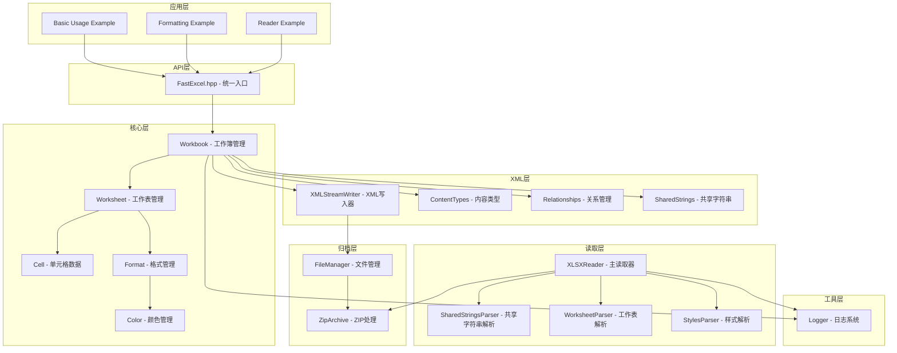
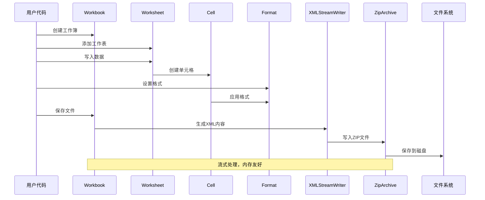
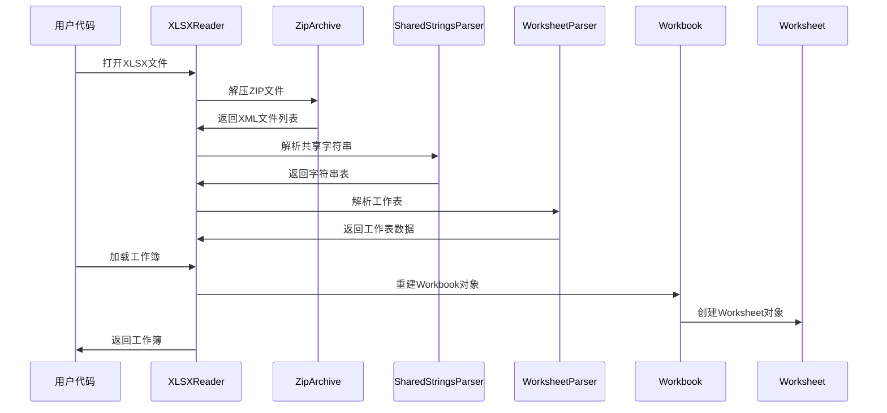
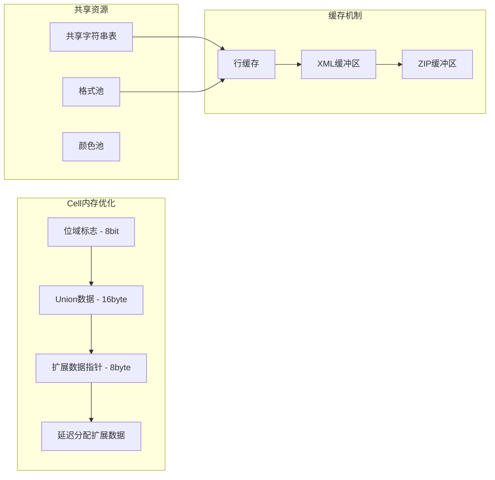
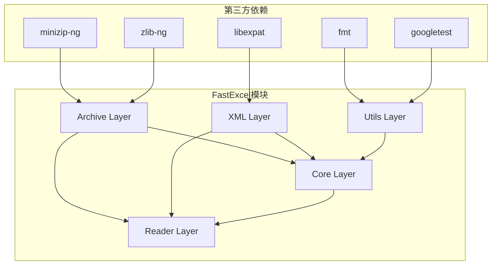
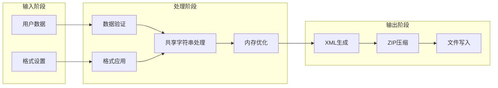
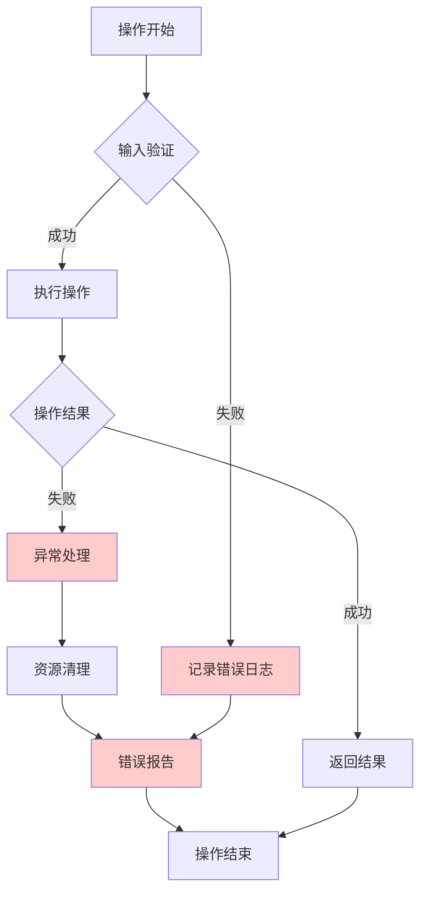
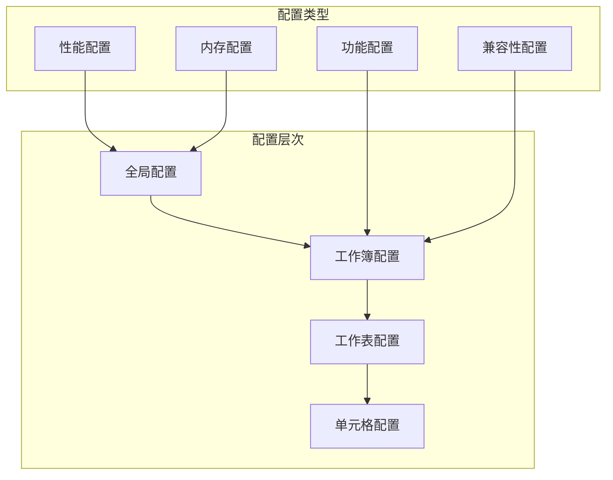

# FastExcel 架构流程图

## 1. 整体架构图



## 2. 写入数据流程图



## 3. 读取数据流程图



## 4. 内存优化架构图



## 5. 性能优化策略图


## 6. 模块依赖关系图



## 7. 类关系图

```mermaid
classDiagram
    class Workbook {
        -worksheets_: vector~Worksheet~
        -formats_: map~int, Format~
        -file_manager_: FileManager
        +addWorksheet(): Worksheet
        +createFormat(): Format
        +save(): bool
    }
    
    class Worksheet {
        -cells_: map~pair~int,int~, Cell~
        -parent_workbook_: Workbook
        +writeString(row, col, value)
        +writeNumber(row, col, value)
        +getCell(row, col): Cell
    }
    
    class Cell {
        -flags_: bitfield
        -value_: union
        -extended_: ExtendedData*
        +setValue(value)
        +setFormat(format)
        +getType(): CellType
    }
    
    class Format {
        -font_properties_
        -alignment_properties_
        -border_properties_
        +setBold(bool)
        +setFontColor(Color)
        +setAlignment(align)
    }
    
    class XLSXReader {
        -zip_archive_: ZipArchive
        -shared_strings_: map
        +open(): bool
        +loadWorksheet(name): Worksheet
        +getMetadata(): WorkbookMetadata
    }
    
    Workbook ||--o{ Worksheet : contains
    Worksheet ||--o{ Cell : contains
    Cell }o--|| Format : uses
    XLSXReader ..> Workbook : creates
```

## 8. 数据处理流水线



## 9. 错误处理流程图



## 10. 配置系统架构



这些流程图从不同角度展示了FastExcel的架构设计：

1. **整体架构图**: 展示各层之间的关系
2. **数据流程图**: 展示写入和读取的完整流程
3. **内存优化图**: 展示内存优化策略
4. **性能优化图**: 展示各种性能优化手段
5. **依赖关系图**: 展示模块间的依赖关系
6. **类关系图**: 展示核心类的关系
7. **处理流水线**: 展示数据处理的各个阶段
8. **错误处理图**: 展示错误处理机制
9. **配置系统图**: 展示配置的层次结构

这些图表有助于理解FastExcel的整体设计思路和实现细节。