# FastExcel 数据流向详细分析

## 1. 整体架构数据流

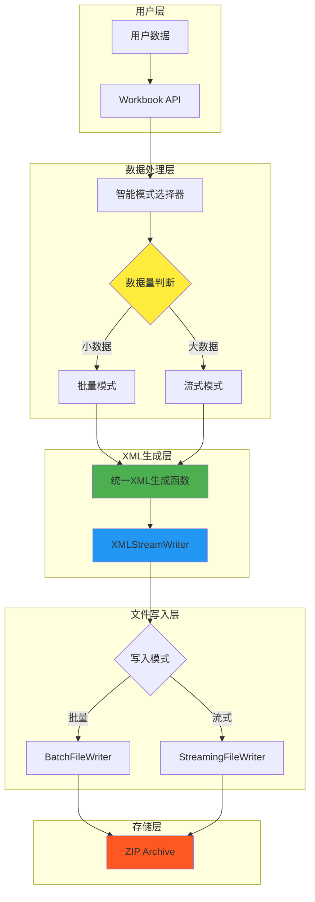

## 2. 批量模式详细数据流

### 2.1 数据收集阶段

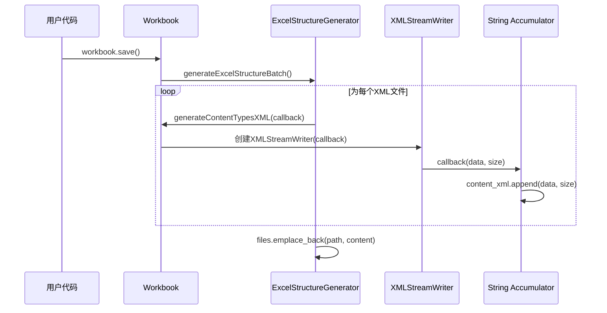

### 2.2 批量写入阶段

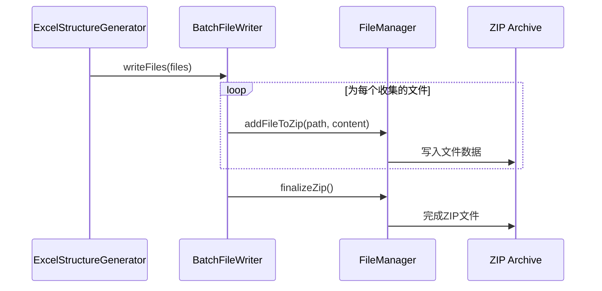

## 3. 流式模式详细数据流

### 3.1 流式写入序列

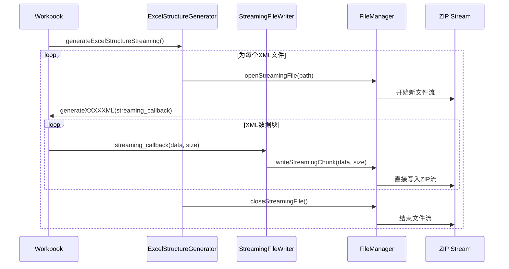

## 4. XMLStreamWriter内部数据流

### 4.1 缓冲区管理流程

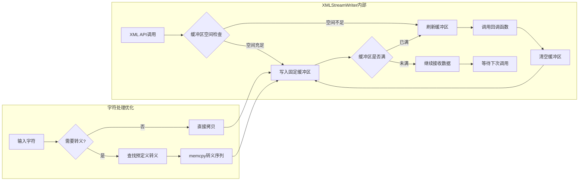

### 4.2 性能优化点标注

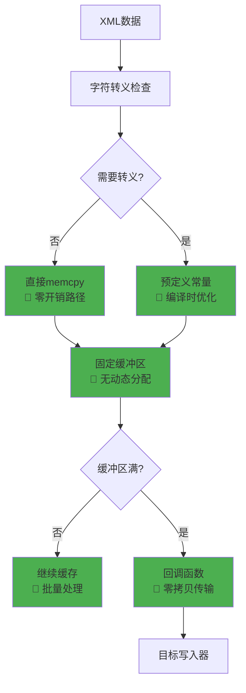

## 5. 智能模式选择数据流

### 5.1 决策流程

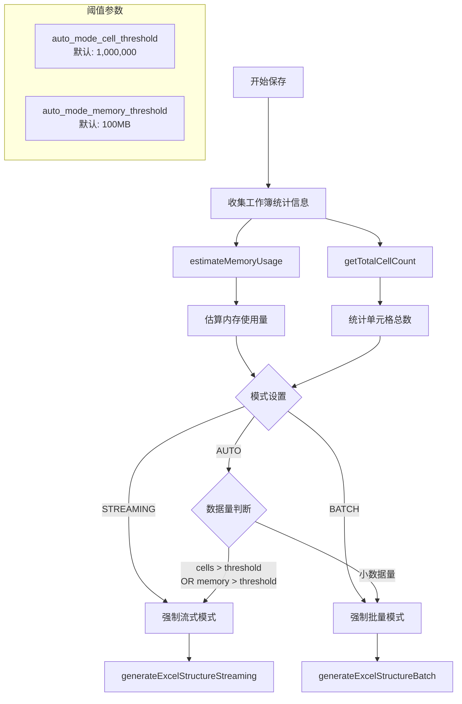

### 5.2 内存估算算法

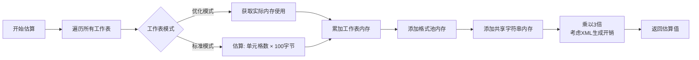

## 6. 工作表XML生成详细流程

### 6.1 工作表数据处理流程

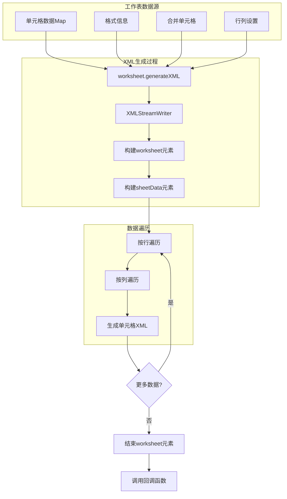

### 6.2 单元格XML生成微观流程

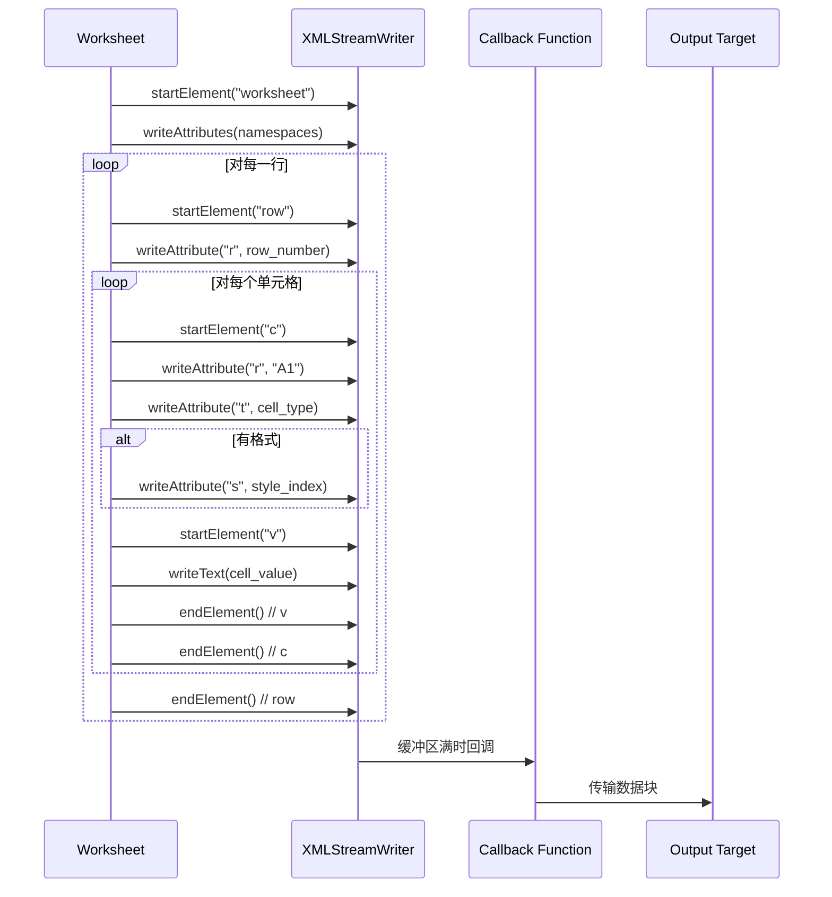

## 7. 错误处理和恢复流程

### 7.1 流式写入错误处理

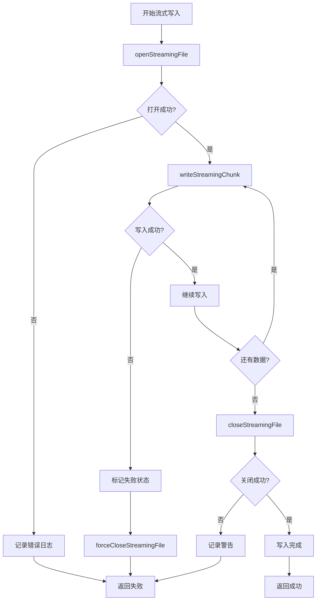

## 8. 性能监控数据流

### 8.1 统计信息收集

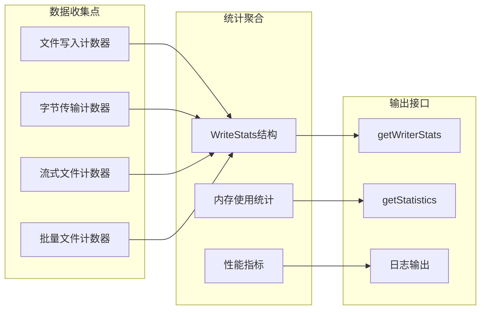

## 9. 内存管理策略

### 9.1 批量模式内存使用

```mermaid
graph TD
    A[开始批量处理] --> B[预分配文件容器]
    B --> C[files.reserve(estimated_files)]
    
    C --> D[生成第一个XML文件]
    D --> E[累积到string对象]
    E --> F[emplace_back with move]
    
    F --> G{还有文件?}
    G -->|是| H[生成下一个文件]
    G -->|否| I[调用writeFiles]
    
    H --> E
    I --> J[移动语义传输]
    J --> K[原有containers自动析构]
    
    style B fill:#4caf50,color:#fff
    style F fill:#4caf50,color:#fff
    style J fill:#4caf50,color:#fff
```

### 9.2 流式模式内存使用

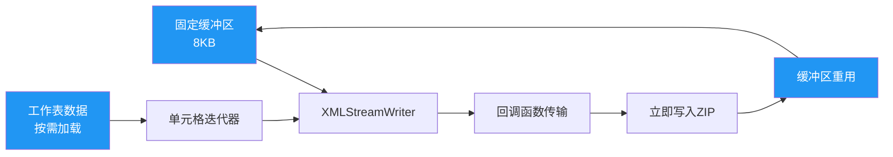

## 10. 总结：数据流向的关键特征

### 10.1 数据传输路径对比

| 模式 | 数据路径 | 内存峰值 | 延迟特性 |
|------|----------|----------|----------|
| **批量模式** | 数据 → 内存缓存 → ZIP | 高（全部数据） | 低（批量I/O） |
| **流式模式** | 数据 → 固定缓冲 → ZIP | 恒定（8KB） | 极低（实时I/O） |

### 10.2 性能优化点汇总


这套流式处理和XML生成系统通过精心设计的数据流向，实现了从内存效率到极致性能的全面优化，为处理不同规模的Excel文件提供了最优解决方案。