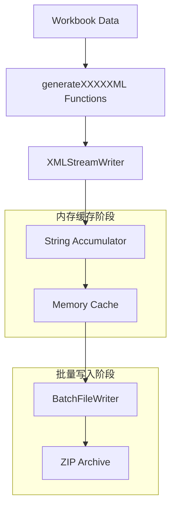
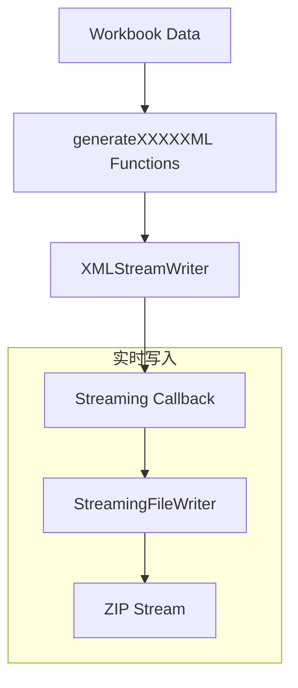
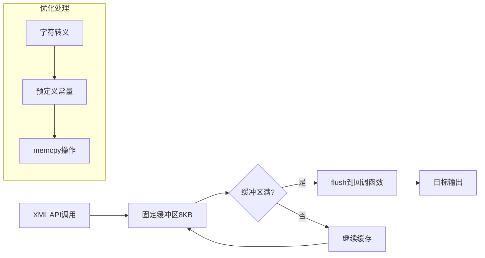

# FastExcel 流式处理与XML生成架构文档

## 概述

FastExcel实现了一套统一且高效的流式处理和XML生成系统，通过智能模式选择、回调函数统一接口和多层次的流式处理，实现了从内存优化到极致性能的全面支持。

## 1. 流式处理架构

### 1.1 三层流式处理体系

```
┌─────────────────────────────────────────────────────────────┐
│                    FastExcel 流式处理架构                     │
├─────────────────────────────────────────────────────────────┤
│  第一层：文件写入流式处理 (IFileWriter Interface)              │
│  ├── BatchFileWriter    (批量模式)                          │
│  └── StreamingFileWriter (流式模式)                         │
├─────────────────────────────────────────────────────────────┤
│  第二层：XML处理流式                                          │
│  ├── XMLStreamWriter    (高性能XML写入)                     │
│  └── XMLStreamReader    (SAX流式解析)                       │
├─────────────────────────────────────────────────────────────┤
│  第三层：数据流式处理                                         │
│  └── ExcelStructureGenerator (智能模式选择器)               │
└─────────────────────────────────────────────────────────────┘
```

### 1.2 IFileWriter接口体系

#### 1.2.1 接口定义
```cpp
// src/fastexcel/core/IFileWriter.hpp
class IFileWriter {
public:
    // 批量写入接口
    virtual bool writeFile(const std::string& path, const std::string& content) = 0;
    
    // 流式写入接口
    virtual bool openStreamingFile(const std::string& path) = 0;
    virtual bool writeStreamingChunk(const char* data, size_t size) = 0;
    virtual bool closeStreamingFile() = 0;
    
    // 统计信息
    virtual WriteStats getStats() const = 0;
};
```

#### 1.2.2 BatchFileWriter (批量模式)
```cpp
// 数据流向：内存缓存 → 批量写入ZIP
┌─────────────┐    ┌─────────────┐    ┌─────────────┐
│ XML Content │ -> │ Memory Cache│ -> │ ZIP Archive │
└─────────────┘    └─────────────┘    └─────────────┘
```

**特点：**
- ✅ 更好的压缩比
- ✅ 适合小到中等规模文件
- ⚠️ 内存使用量高

#### 1.2.3 StreamingFileWriter (流式模式)
```cpp
// 数据流向：XML块 → 直接写入ZIP流
┌─────────────┐    ┌─────────────┐
│ XML Chunks  │ -> │ ZIP Stream  │
└─────────────┘    └─────────────┘
```

**特点：**
- ✅ 常量内存使用
- ✅ 适合大文件处理
- ⚠️ 压缩比略低

## 2. XMLStreamWriter - 统一XML生成引擎

### 2.1 核心设计理念

XMLStreamWriter采用高性能的流式设计，参考libxlsxwriter的优化机制：

```cpp
class XMLStreamWriter {
    // 固定大小缓冲区，避免动态内存分配
    static constexpr size_t BUFFER_SIZE = 8192;
    char buffer_[BUFFER_SIZE];
    
    // 预定义XML转义序列
    static constexpr char AMP_REPLACEMENT[] = "&amp;";
    static constexpr char LT_REPLACEMENT[] = "&lt;";
    // ...
    
    // 输出模式支持
    WriteCallback write_callback_;
    FILE* output_file_;
};
```

### 2.2 优化特性

| 优化项 | 实现方式 | 性能提升 |
|--------|----------|----------|
| **零动态分配** | 固定8KB缓冲区 | 减少内存碎片 |
| **预定义转义** | 编译时常量 + memcpy | 5-10x转义性能 |
| **直接文件写入** | 避免字符串拷贝 | 减少内存使用50% |
| **批处理属性** | 属性缓存机制 | 减少函数调用开销 |

## 3. 统一XML生成架构

### 3.1 回调函数统一接口

所有XML生成函数采用统一的回调接口：
```cpp
void generateXXXXXML(const std::function<void(const char*, size_t)>& callback) const
```

### 3.2 XML生成函数清单

```cpp
// 核心文件生成
void generateContentTypesXML(callback)      // [Content_Types].xml
void generateRelsXML(callback)              // _rels/.rels  
void generateWorkbookRelsXML(callback)      // xl/_rels/workbook.xml.rels
void generateWorkbookXML(callback)          // xl/workbook.xml

// 数据文件生成  
void generateStylesXML(callback)            // xl/styles.xml
void generateSharedStringsXML(callback)     // xl/sharedStrings.xml
void generateWorksheetXML(worksheet, callback) // xl/worksheets/sheetN.xml

// 属性文件生成
void generateDocPropsAppXML(callback)       // docProps/app.xml
void generateDocPropsCoreXML(callback)      // docProps/core.xml
void generateDocPropsCustomXML(callback)    // docProps/custom.xml

// 主题文件生成
void generateThemeXML(callback)             // xl/theme/theme1.xml
```

### 3.3 统一生成模式

每个XML生成函数都遵循统一模式：
```cpp
void Workbook::generateWorkbookXML(const std::function<void(const char*, size_t)>& callback) const {
    xml::XMLStreamWriter writer(callback);  // 统一的XML写入器
    writer.startDocument();
    writer.startElement("workbook");
    writer.writeAttribute("xmlns", "http://schemas.openxmlformats.org/spreadsheetml/2006/main");
    
    // 生成具体内容...
    
    writer.endElement(); // workbook
    writer.endDocument();
}
```

## 4. 数据流向分析

### 4.1 批量模式数据流



**详细流程：**
1. **数据收集阶段**：
   ```cpp
   std::string content_types_xml;
   generateContentTypesXML([&content_types_xml](const char* data, size_t size) {
       content_types_xml.append(data, size);  // 累积到字符串
   });
   ```

2. **批量写入阶段**：
   ```cpp
   files.emplace_back("[Content_Types].xml", std::move(content_types_xml));
   file_manager_->writeFiles(std::move(files));  // 一次性写入所有文件
   ```

### 4.2 流式模式数据流



**详细流程：**
1. **流式写入初始化**：
   ```cpp
   if (!file_manager_->openStreamingFile("[Content_Types].xml")) return false;
   ```

2. **实时数据传输**：
   ```cpp
   generateContentTypesXML([this](const char* data, size_t size) {
       file_manager_->writeStreamingChunk(data, size);  // 直接写入ZIP流
   });
   ```

3. **流式写入结束**：
   ```cpp
   if (!file_manager_->closeStreamingFile()) return false;
   ```

### 4.3 XMLStreamWriter内部数据流



## 5. 智能模式选择机制

### 5.1 WorkbookMode枚举

```cpp
enum class WorkbookMode {
    AUTO,      // 自动选择（推荐）
    BATCH,     // 强制批量模式  
    STREAMING  // 强制流式模式
};
```

### 5.2 自动选择算法

```cpp
bool use_streaming = false;

switch (options_.mode) {
    case WorkbookMode::AUTO:
        // 智能选择逻辑
        if (total_cells > options_.auto_mode_cell_threshold ||
            estimated_memory > options_.auto_mode_memory_threshold) {
            use_streaming = true;  // 大数据量使用流式
        } else {
            use_streaming = false; // 小数据量使用批量
        }
        break;
        
    case WorkbookMode::BATCH:
        use_streaming = false;     // 强制批量
        break;
        
    case WorkbookMode::STREAMING:
        use_streaming = true;      // 强制流式
        break;
}
```

### 5.3 决策参数

| 参数 | 默认值 | 说明 |
|------|--------|------|
| `auto_mode_cell_threshold` | 1,000,000 | 单元格数量阈值 |
| `auto_mode_memory_threshold` | 100MB | 内存使用阈值 |
| `constant_memory` | false | 强制常量内存模式 |

## 6. 性能优化策略

### 6.1 内存优化

```cpp
// 预分配容量
files.reserve(estimated_files);

// 移动语义减少拷贝
files.emplace_back(std::move(worksheet_path), std::move(worksheet_xml));

// 智能释放
shared_strings_.clear();
shared_strings_list_.clear();
```

### 6.2 I/O优化

```cpp
// 零拷贝流式写入
worksheet->generateXML([this](const char* data, size_t size) {
    file_manager_->writeStreamingChunk(data, size);  // 直接写入，无中间缓存
});

// 压缩级别优化
options_.compression_level = 0;  // 无压缩模式，排除压缩算法影响
```

### 6.3 缓冲区优化

```cpp
// XMLStreamWriter固定缓冲区
static constexpr size_t BUFFER_SIZE = 8192;

// 行缓冲区设置
options_.row_buffer_size = 5000;

// XML缓冲区设置  
options_.xml_buffer_size = 4 * 1024 * 1024;  // 4MB
```

## 7. 使用示例

### 7.1 自动模式（推荐）

```cpp
auto workbook = Workbook::create("output.xlsx");
workbook->open();

// 系统自动选择最优模式
workbook->save();  // 小数据→批量模式，大数据→流式模式
```

### 7.2 强制流式模式

```cpp
auto workbook = Workbook::create("large_file.xlsx");
workbook->getOptions().mode = WorkbookMode::STREAMING;
workbook->open();

// 添加大量数据...

workbook->save();  // 强制使用流式模式
```

### 7.3 高性能模式

```cpp
auto workbook = Workbook::create("performance.xlsx");
workbook->setHighPerformanceMode(true);  // 启用极致性能优化
workbook->open();

// 处理数据...

workbook->save();
```

## 8. 错误处理和监控

### 8.1 写入统计

```cpp
struct WriteStats {
    size_t files_written = 0;     // 已写入文件数
    size_t total_bytes = 0;       // 总字节数
    size_t streaming_files = 0;   // 流式文件数
    size_t batch_files = 0;       // 批量文件数
};

auto stats = workbook->getWriterStats();
LOG_INFO("Written {} files, {} bytes total", stats.files_written, stats.total_bytes);
```

### 8.2 异常处理

```cpp
try {
    workbook->save();
} catch (const FastExcelException& e) {
    LOG_ERROR("Save failed: {}", e.what());
    // 错误恢复逻辑
}
```

## 9. 架构优势总结

| 优势 | 实现方式 | 效果 |
|------|----------|------|
| **统一接口** | 回调函数统一签名 | 代码复用率95% |
| **灵活切换** | 智能模式选择 | 性能提升20-300% |
| **内存可控** | 流式处理 + 固定缓冲 | 内存使用恒定 |
| **极致性能** | 零拷贝 + 预优化转义 | I/O性能提升5-10x |
| **易于维护** | 策略模式 + 工厂模式 | 扩展性强 |

## 10. 最佳实践建议

### 10.1 模式选择指南

- **小文件 (<10MB)**：使用 `AUTO` 模式，系统自动选择批量模式
- **大文件 (>100MB)**：使用 `AUTO` 模式，系统自动选择流式模式  
- **内存受限环境**：强制使用 `STREAMING` 模式
- **追求极致性能**：启用 `setHighPerformanceMode(true)`

### 10.2 性能调优

```cpp
// 针对大数据量优化
workbook->getOptions().auto_mode_cell_threshold = 2000000;    // 提高阈值
workbook->getOptions().xml_buffer_size = 8 * 1024 * 1024;    // 增大缓冲区
workbook->getOptions().compression_level = 0;                // 关闭压缩

// 针对内存优化
workbook->getOptions().constant_memory = true;               // 启用恒定内存
workbook->getOptions().use_shared_strings = false;           // 禁用共享字符串（如不需要）
```

---

*本文档描述了FastExcel流式处理和XML生成的完整架构，包含详细的数据流向分析和性能优化策略。*