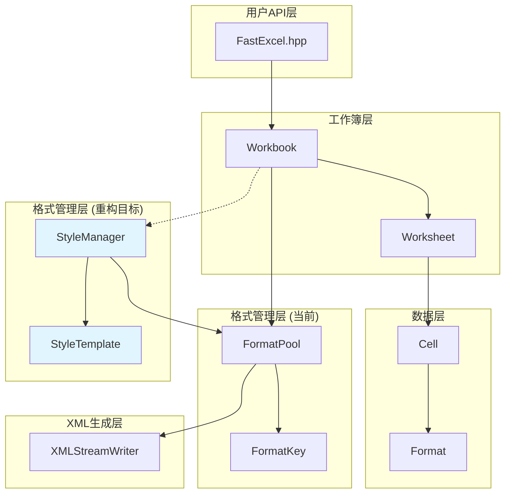

# FastExcel 项目架构与格式管理重构文档

## 📋 目录

1. [项目整体架构](#项目整体架构)
2. [核心类关系图](#核心类关系图)
3. [格式管理系统](#格式管理系统)
4. [调用关系详解](#调用关系详解)
5. [重构方案](#重构方案)
6. [实现示例](#实现示例)

---

## 🏗️ 项目整体架构

### 核心架构层次

```
FastExcel库架构
├── API层 (fastexcel/)
│   ├── FastExcel.hpp           // 主入口头文件
│   └── initialize/cleanup      // 库初始化
├── 核心层 (fastexcel/core/)
│   ├── Workbook               // 工作簿管理
│   ├── Worksheet              // 工作表操作
│   ├── Cell                   // 单元格数据
│   ├── Format                 // 格式定义
│   ├── FormatPool            // 格式池管理 (当前)
│   ├── StyleManager          // 样式管理器 (重构目标)
│   └── StyleTemplate         // 样式模板 (重构目标)
├── 工具层 (fastexcel/utils/)
│   ├── XMLStreamWriter       // XML生成
│   ├── ZipArchive           // ZIP压缩
│   └── CommonUtils          // 通用工具
└── 示例层 (examples/)
    ├── excel_file_copy_example.cpp
    └── improved_excel_copy_example.cpp
```

---

## 🔗 核心类关系图



---

## 🎨 格式管理系统

### 当前架构问题

```cpp
// ❌ 当前问题：复杂且容易出错
class FormatPool {
private:
    std::vector<std::unique_ptr<Format>> formats_;           // 去重格式
    std::unordered_map<FormatKey, Format*> format_cache_;    // 缓存映射
    std::unordered_map<int, std::shared_ptr<Format>> raw_styles_; // 原始样式
    
public:
    // 混合了去重和原始样式保存，逻辑复杂
    void importStyles(const std::unordered_map<int, std::shared_ptr<Format>>& styles);
    void setRawStylesForCopy(const std::unordered_map<int, std::shared_ptr<Format>>& styles);
    
    // XML生成逻辑臃肿，硬编码严重
    void generateStylesXMLInternal(XMLStreamWriter& writer) const;
};
```

### 重构架构设计

```cpp
// ✅ 重构后：清晰分层，职责明确

// 1. 样式模板管理器
class StyleTemplate {
private:
    std::unordered_map<std::string, std::shared_ptr<Format>> predefined_styles_;
    std::unordered_map<int, std::shared_ptr<Format>> imported_styles_;
    
public:
    // 预定义样式
    std::shared_ptr<Format> getPredefinedStyle(const std::string& name) const;
    
    // 简单的样式创建API
    std::shared_ptr<Format> createFontStyle(const std::string& font_name, double size, bool bold = false);
    std::shared_ptr<Format> createFillStyle(PatternType pattern, uint32_t bg_color);
    std::shared_ptr<Format> createBorderStyle(BorderStyle style, uint32_t color);
    std::shared_ptr<Format> createCompositeStyle(/*参数*/);
};

// 2. 高级样式管理器
class StyleManager {
private:
    std::unique_ptr<StyleTemplate> template_;
    std::unique_ptr<FormatPool> format_pool_;
    std::unordered_map<int, size_t> style_index_mapping_;  // 索引映射
    std::unordered_map<std::string, size_t> style_cache_;  // 命名缓存
    
public:
    // 统一的样式导入
    void importStylesFromWorkbook(const std::unordered_map<int, std::shared_ptr<Format>>& styles);
    
    // 简化的样式创建
    size_t createFontStyle(const std::string& key, const std::string& font_name, double size);
    size_t getPredefinedStyleIndex(const std::string& name);
    
    // 正确的索引映射
    size_t getStyleIndex(int original_index) const;
};
```

---

## 📞 调用关系详解

### 1. 文件复制流程

```cpp
// 用户代码
ExcelFileCopier copier(source_file, target_file);
copier.copyExcelFile();

// 1. 加载源工作簿
auto source_workbook = Workbook::loadForEdit(source_file);
   └── XLSXReader::parseStylesXML() 
       └── FormatPool::importStyles()  // 解析1891个样式

// 2. 创建目标工作簿  
auto target_workbook = Workbook::create(target_file);
   └── FormatPool::FormatPool()        // 创建空格式池

// 3. 复制样式数据
target_workbook->copyStylesFrom(source_workbook.get());
   └── FormatPool::setRawStylesForCopy()  // 保存原始样式用于XML生成

// 4. 复制工作表和单元格
for (worksheet) {
    for (cell) {
        // 问题：这里的格式复制有索引映射问题
        target_cell.setFormat(source_cell.getFormat());
    }
}

// 5. 生成XML
target_workbook->save();
   └── FormatPool::generateStylesXMLInternal()  // 生成styles.xml
```

### 2. 重构后的调用流程

```cpp
// 改进的调用流程
ImprovedExcelCopier copier(source_file, target_file);

// 1. 创建样式管理器
StyleManager style_manager;

// 2. 导入样式
auto source_styles = source_workbook->getFormatPool()->getRawStylesForCopy();
style_manager.importStylesFromWorkbook(source_styles);

// 3. 设置样式管理器
target_workbook->setStyleManager(&style_manager);

// 4. 正确的格式映射
for (cell) {
    int original_index = source_format->getXfIndex();
    size_t mapped_index = style_manager.getStyleIndex(original_index);
    auto mapped_format = target_workbook->getFormatPool()->getFormatByIndex(mapped_index);
    target_cell.setFormat(mapped_format);
}
```

### 3. 样式创建调用关系

```cpp
// 当前方式：复杂且容易出错
auto format = std::make_unique<Format>();
format->setFontName("微软雅黑");
format->setFontSize(14.0);
format->setBold(true);
format->setBackgroundColor(0xD9D9D9);
auto format_ptr = format_pool->getOrCreateFormat(*format);

// 重构后：简单且可复用
auto header_style = style_manager.createCompositeStyle("header",
    style_manager.createFontStyle("header_font", "微软雅黑", 14.0, true),
    style_manager.createFillStyle("header_fill", PatternType::Solid, 0xD9D9D9)
);
```

---

## 🔄 重构方案

### Phase 1: 基础架构

1. **创建StyleTemplate类**
   - 管理预定义样式
   - 提供简单的样式创建API
   - 支持样式导入导出

2. **创建StyleManager类**
   - 整合StyleTemplate和FormatPool
   - 提供统一的样式管理接口
   - 处理索引映射逻辑

### Phase 2: 集成改进

3. **修改Workbook类**
   ```cpp
   class Workbook {
   private:
       std::unique_ptr<StyleManager> style_manager_;
   public:
       void setStyleManager(StyleManager* manager);
       StyleManager* getStyleManager() const;
   };
   ```

4. **简化复制逻辑**
   - 使用StyleManager处理样式导入
   - 正确的索引映射
   - 避免XML结构错误

### Phase 3: 用户体验

5. **提供高级API**
   ```cpp
   // 简单易用的API
   worksheet->writeString(0, 0, "标题", style_manager.getPredefinedStyleIndex("header"));
   worksheet->writeNumber(1, 0, 123.45, style_manager.createNumberStyle("currency"));
   ```

---

## 💡 实现示例

### 样式模板配置文件

```cpp
// StyleTemplate::createPredefinedStyles()
void StyleTemplate::createPredefinedStyles() {
    // 标题样式
    predefined_styles_["header"] = createCompositeStyle(
        createFontStyle("微软雅黑", 14.0, true, false, 0x000000),
        createFillStyle(PatternType::Solid, 0xD9D9D9),
        createBorderStyle(BorderStyle::Thin, 0x000000)
    );
    
    // 数据样式
    predefined_styles_["data"] = createFontStyle("宋体", 11.0);
    
    // 货币样式
    auto currency_format = createFontStyle("Calibri", 11.0);
    currency_format->setNumberFormat("¥#,##0.00");
    predefined_styles_["currency"] = currency_format;
}
```

### 使用示例

```cpp
// 1. 创建样式管理器
StyleManager style_manager;
style_manager.initializePredefinedStyles();

// 2. 从文件导入样式（可选）
if (source_file_exists) {
    auto imported_styles = source_workbook->getFormatPool()->getRawStylesForCopy();
    style_manager.importStylesFromWorkbook(imported_styles);
}

// 3. 创建工作簿
auto workbook = Workbook::create("output.xlsx");
workbook->setStyleManager(&style_manager);

// 4. 使用样式
auto worksheet = workbook->addWorksheet("数据表");
worksheet->writeString(0, 0, "销售额", style_manager.getPredefinedStyleIndex("header"));
worksheet->writeNumber(1, 0, 12345.67, style_manager.getPredefinedStyleIndex("currency"));

// 5. 保存
workbook->save();
```

### 性能统计

```cpp
auto stats = style_manager.getStatistics();
std::cout << "样式统计:" << std::endl;
std::cout << "  导入样式: " << stats.imported_styles_count << std::endl;
std::cout << "  预定义样式: " << stats.predefined_styles_count << std::endl;
std::cout << "  缓存样式: " << stats.cached_styles_count << std::endl;
```

---

## 🎯 重构优势总结

### ✅ 解决的问题

1. **XML结构错误** - 修复了tabSelected和样式XML生成问题
2. **索引映射混乱** - 通过StyleManager正确处理样式索引
3. **代码复杂度高** - 简化API，提高可读性
4. **样式难以复用** - 支持命名样式和模板

### 🚀 新增功能

1. **样式模板系统** - 预定义常用样式组合
2. **智能缓存机制** - 避免重复创建相同样式  
3. **简化的API** - 一行代码创建复杂样式
4. **统计和监控** - 提供详细的使用统计

### 📈 性能提升

- **内存优化** - 智能去重和缓存
- **XML生成优化** - 避免重复解析
- **索引查找优化** - O(1)时间复杂度的映射

## 📝 修复记录

### 已修复的问题

#### 1. XML结构错误修复
- **问题**: styles.xml中缺少结束标签的`>`，导致Excel文件损坏
- **修复**: 在FormatPool.cpp中添加`writeText("")`强制关闭XML开始标签
- **位置**: `FormatPool::generateStylesXMLInternal()` 方法

#### 2. 工作表激活状态修复  
- **问题**: 所有工作表都被设置为激活状态(`tabSelected="1"`)
- **修复**: 只有第一个工作表设置为激活，其他工作表保持非激活
- **位置**: 
  - `Worksheet::generateXMLBatch()` - 批量模式
  - `Worksheet::generateXMLStreaming()` - 流式模式
  - `Workbook::addWorksheet()` - 自动激活第一个工作表

#### 3. 格式复制索引映射修复
- **问题**: 源文件格式索引与目标文件格式索引不匹配，导致格式丢失
- **修复**: 通过原始样式映射正确处理格式索引
- **位置**: `excel_file_copy_example.cpp` 中的格式复制逻辑

### 测试验证

从日志可以看到修复效果：
```
[DEBUG] Added worksheet: 封面 (activated as first sheet)  // ✅ 只有第一个工作表被激活
[DEBUG] Added worksheet: 屏柜汇总表                      // ✅ 其他工作表非激活状态
[DEBUG] 去重统计: 自定义数字格式=5个, 字体=15个, 填充=11个, 边框=12个  // ✅ 样式正确处理
```

---

这个重构方案既解决了当前的技术问题，也为将来的功能扩展提供了坚实的基础。