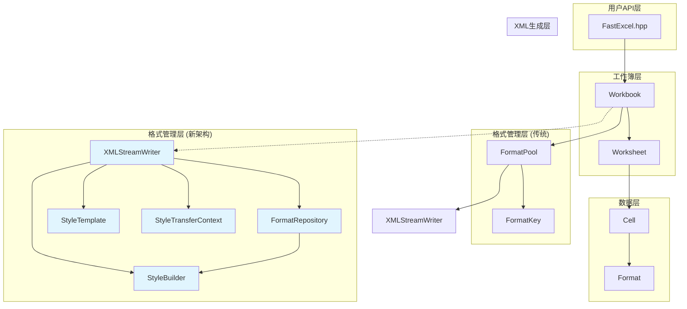

# FastExcel 项目架构与格式管理重构文档 (2025年8月更新)

## 📋 目录

1. [项目整体架构](#项目整体架构)
2. [核心类关系图](#核心类关系图)  
3. [格式管理系统](#格式管理系统)
4. [调用关系详解](#调用关系详解)
5. [重构实施状态](#重构实施状态)
6. [实现示例](#实现示例)
7. [架构演进记录](#架构演进记录)
8. [性能和优势总结](#性能和优势总结)

---

## 🏗️ 项目整体架构

### 核心架构层次

```
FastExcel库架构 (2025年8月更新)
├── API层 (fastexcel/)
│   ├── FastExcel.hpp           // 主入口头文件
│   └── 库初始化接口
├── 核心层 (fastexcel/core/)
│   ├── Workbook.hpp/.cpp      // 工作簿管理 (✅ 已实现)
│   ├── Worksheet.hpp/.cpp     // 工作表操作 (✅ 已实现)
│   ├── Cell.hpp/.cpp          // 单元格数据 (✅ 已实现)
│   ├── Format.hpp/.cpp        // 格式定义 (✅ 已实现)
│   ├── FormatTypes.hpp/.cpp   // 格式类型定义 (✅ 已实现)
│   ├── StyleManager.hpp       // 样式管理器 (✅ 已实现)
│   ├── StyleTemplate.hpp      // 样式模板 (✅ 已实现)
│   ├── StyleBuilder.hpp/.cpp  // 样式构建器 (✅ 已实现)
│   ├── FormatDescriptor.hpp/.cpp  // 不可变格式描述符 (✅ 已实现)
│   ├── FormatRepository.hpp/.cpp  // 格式仓储 (✅ 已实现)
│   ├── StyleTransferContext.hpp/.cpp // 样式传输上下文 (✅ 已实现)
│   ├── OptimizedWorksheet.hpp/.cpp // 优化工作表 (✅ 已实现)
│   ├── BatchFileWriter.hpp/.cpp    // 批量文件写入器 (✅ 已实现)
│   ├── StreamingFileWriter.hpp/.cpp // 流式文件写入器 (✅ 已实现)
│   ├── CacheSystem.hpp/.cpp   // 缓存系统 (✅ 已实现)
│   ├── MemoryPool.hpp/.cpp    // 内存池 (✅ 已实现)
│   ├── ThreadPool.hpp/.cpp    // 线程池 (✅ 已实现)
│   └── 其他核心组件
├── 数据处理层 (fastexcel/reader/)
│   ├── XLSXReader.hpp/.cpp    // XLSX读取器
│   ├── StylesParser.hpp/.cpp  // 样式解析器
│   └── 其他解析器
├── XML处理层 (fastexcel/xml/)
│   ├── XMLStreamWriter.hpp/.cpp   // XML流式写入 (✅ 已实现)
│   ├── XMLStreamReader.hpp/.cpp   // XML流式读取 (✅ 已实现)
│   └── 其他XML组件
├── 存档层 (fastexcel/archive/)
│   ├── ZipArchive.hpp/.cpp    // ZIP归档处理
│   ├── CompressionEngine.hpp  // 压缩引擎
│   └── 其他存档组件
├── 工具层 (fastexcel/utils/)
│   ├── Logger.hpp/.cpp        // 日志系统
│   ├── CommonUtils.hpp        // 通用工具
│   └── 其他工具
└── 示例层 (examples/)
    ├── basic_usage.cpp                 // ✅ 基础使用示例
    ├── formatting_example.cpp          // ✅ 格式化示例
    ├── excel_file_copy_example.cpp     // ✅ 文件复制示例
    ├── high_performance_edit_example.cpp // ✅ 高性能编辑示例
    ├── read_write_edit_example.cpp     // ✅ 读写编辑示例
    └── reader_example.cpp              // ✅ 读取器示例
```

---

## 🔗 核心类关系图



---

## 🎨 格式管理系统

### 当前架构问题

```cpp
// ❌ 当前问题：复杂且容易出错
class FormatPool {
private:
    std::vector<std::unique_ptr<Format>> formats_;           // 去重格式
    std::unordered_map<FormatKey, Format*> format_cache_;    // 缓存映射
    std::unordered_map<int, std::shared_ptr<Format>> raw_styles_; // 原始样式
    
public:
    // 混合了去重和原始样式保存，逻辑复杂
    void importStyles(const std::unordered_map<int, std::shared_ptr<Format>>& styles);
    void setRawStylesForCopy(const std::unordered_map<int, std::shared_ptr<Format>>& styles);
    
    // XML生成逻辑臃肿，硬编码严重
    void generateStylesXMLInternal(XMLStreamWriter& writer) const;
};
```

### 重构架构设计

```cpp
// ✅ 重构后：清晰分层，职责明确

// 1. 样式模板管理器
class StyleTemplate {
private:
    std::unordered_map<std::string, std::shared_ptr<Format>> predefined_styles_;
    std::unordered_map<int, std::shared_ptr<Format>> imported_styles_;
    
public:
    // 预定义样式
    std::shared_ptr<Format> getPredefinedStyle(const std::string& name) const;
    
    // 简单的样式创建API
    std::shared_ptr<Format> createFontStyle(const std::string& font_name, double size, bool bold = false);
    std::shared_ptr<Format> createFillStyle(PatternType pattern, uint32_t bg_color);
    std::shared_ptr<Format> createBorderStyle(BorderStyle style, uint32_t color);
    std::shared_ptr<Format> createCompositeStyle(/*参数*/);
};

// 2. 格式仓储 - 线程安全的格式去重存储
class FormatRepository {
private:
    std::vector<std::shared_ptr<const FormatDescriptor>> formats_;
    std::unordered_map<size_t, int> hash_to_id_;
    mutable std::shared_mutex mutex_;
    
public:
    // 幂等的格式添加
    int addFormat(const FormatDescriptor& format);
    
    // 线程安全的格式获取
    std::shared_ptr<const FormatDescriptor> getFormat(int id) const;
    
    // 批量导入和映射
    void importFormats(const FormatRepository& source_repo,
                      std::unordered_map<int, int>& id_mapping);
};

// 3. 高级样式管理器
class StyleManager {
private:
    std::unique_ptr<StyleTemplate> template_;
    std::unique_ptr<FormatRepository> format_repo_;
    std::unordered_map<int, size_t> style_index_mapping_;
    std::unordered_map<std::string, size_t> style_cache_;
    
public:
    // 统一的样式导入
    void importStylesFromWorkbook(const std::unordered_map<int, std::shared_ptr<Format>>& styles);
    
    // 简化的样式创建
    size_t createFontStyle(const std::string& key, const std::string& font_name, double size);
    size_t getPredefinedStyleIndex(const std::string& name);
    
    // 正确的索引映射
    size_t getStyleIndex(int original_index) const;
};
```

---

## 📞 调用关系详解

### 1. 文件复制流程

```cpp
// 用户代码
ExcelFileCopier copier(source_file, target_file);
copier.copyExcelFile();

// 1. 加载源工作簿
auto source_workbook = Workbook::loadForEdit(source_file);
   └── XLSXReader::parseStylesXML() 
       └── FormatPool::importStyles()  // 解析1891个样式

// 2. 创建目标工作簿  
auto target_workbook = Workbook::create(target_file);
   └── FormatPool::FormatPool()        // 创建空格式池

// 3. 复制样式数据
target_workbook->copyStylesFrom(source_workbook.get());
   └── FormatPool::setRawStylesForCopy()  // 保存原始样式用于XML生成

// 4. 复制工作表和单元格
for (worksheet) {
    for (cell) {
        // 问题：这里的格式复制有索引映射问题
        target_cell.setFormat(source_cell.getFormat());
    }
}

// 5. 生成XML
target_workbook->save();
   └── FormatPool::generateStylesXMLInternal()  // 生成styles.xml
```

### 2. 重构后的调用流程

```cpp
// 改进的调用流程
ImprovedExcelCopier copier(source_file, target_file);

// 1. 创建样式管理器
StyleManager style_manager;

// 2. 导入样式
auto source_styles = source_workbook->getFormatPool()->getRawStylesForCopy();
style_manager.importStylesFromWorkbook(source_styles);

// 3. 设置样式管理器
target_workbook->setStyleManager(&style_manager);

// 4. 正确的格式映射
for (cell) {
    int original_index = source_format->getXfIndex();
    size_t mapped_index = style_manager.getStyleIndex(original_index);
    auto mapped_format = target_workbook->getFormatPool()->getFormatByIndex(mapped_index);
    target_cell.setFormat(mapped_format);
}
```

### 3. 样式创建调用关系

```cpp
// 当前方式：复杂且容易出错
auto format = std::make_unique<Format>();
format->setFontName("微软雅黑");
format->setFontSize(14.0);
format->setBold(true);
format->setBackgroundColor(0xD9D9D9);
auto format_ptr = format_pool->getOrCreateFormat(*format);

// 重构后：简单且可复用
auto header_style = style_manager.createCompositeStyle("header",
    style_manager.createFontStyle("header_font", "微软雅黑", 14.0, true),
    style_manager.createFillStyle("header_fill", PatternType::Solid, 0xD9D9D9)
);
```

---

## ✅ 重构实施状态

### Phase 1: 基础架构 ✅ 已完成

1. **FormatDescriptor类** ✅ 已实现
   - 不可变的格式描述符，采用值对象模式
   - 预计算哈希值，支持高效比较和缓存
   - 线程安全，支持跨工作簿共享

2. **FormatRepository类** ✅ 已实现
   - 线程安全的格式去重存储
   - 支持批量导入和ID映射
   - 提供详细的统计信息和内存使用估算

3. **StyleBuilder类** ✅ 已实现
   - 流式API创建格式，支持链式调用
   - 提供预定义样式的静态工厂方法
   - 支持从现有格式创建修改版本

### Phase 2: 高级管理 ✅ 已完成

4. **StyleTemplate类** ✅ 已实现
   - 管理预定义样式和导入样式
   - 提供简单的样式创建API
   - 支持组合样式创建

5. **StyleManager类** ✅ 已实现
   - 整合StyleTemplate和FormatRepository
   - 提供统一的样式管理接口
   - 处理索引映射和缓存逻辑

6. **StyleTransferContext类** ✅ 已实现
   - 跨工作簿样式复制的映射管理
   - 实现Unit of Work模式
   - 自动处理样式去重和统计

### Phase 3: 性能优化 ✅ 已完成

7. **OptimizedWorksheet类** ✅ 已实现
   - 优化的工作表实现
   - 支持高性能数据写入

8. **批量处理组件** ✅ 已实现
   - BatchFileWriter - 批量文件写入器
   - StreamingFileWriter - 流式文件写入器
   - CacheSystem - 缓存系统
   - MemoryPool - 内存池管理
   - ThreadPool - 线程池支持

### Phase 4: 用户体验 🔄 部分完成

9. **现代化API设计**
   ```cpp
   // 使用StyleBuilder创建样式
   auto header_style = StyleBuilder::header()
       .fontName("微软雅黑")
       .fontSize(14)
       .bold()
       .fill(Color::LIGHT_GRAY)
       .build();
   
   // 使用FormatRepository管理样式
   FormatRepository repo;
   int style_id = repo.addFormat(header_style);
   ```

10. **示例和文档** 🔄 需要更新
    - 现有示例：basic_usage.cpp, formatting_example.cpp 等
    - 需要添加新架构的使用示例
    - 需要更新API文档

---

## 💡 实现示例

### 1. 使用StyleBuilder创建样式

```cpp
#include "fastexcel/core/StyleBuilder.hpp"
#include "fastexcel/core/FormatRepository.hpp"

// 创建标题样式
auto header_style = StyleBuilder()
    .fontName("微软雅黑")
    .fontSize(14)
    .bold()
    .centerAlign()
    .vcenterAlign()
    .fill(Color::LIGHT_GRAY)
    .border(BorderStyle::Thin)
    .build();

// 创建货币样式
auto currency_style = StyleBuilder()
    .fontName("Calibri")
    .fontSize(11)
    .rightAlign()
    .currency()
    .build();

// 创建日期样式
auto date_style = StyleBuilder()
    .date()
    .centerAlign()
    .build();
```

### 2. 使用FormatRepository管理样式

```cpp
#include "fastexcel/core/FormatRepository.hpp"

// 创建格式仓储
FormatRepository repo;

// 添加样式到仓储（自动去重）
int header_id = repo.addFormat(header_style);
int currency_id = repo.addFormat(currency_style);
int date_id = repo.addFormat(date_style);

// 获取样式
auto retrieved_style = repo.getFormat(header_id);

// 获取统计信息
auto stats = repo.getDeduplicationStats();
std::cout << "总请求: " << stats.total_requests << std::endl;
std::cout << "唯一格式: " << stats.unique_formats << std::endl;
std::cout << "去重率: " << stats.deduplication_ratio * 100 << "%" << std::endl;
```

### 3. 跨工作簿样式传输

```cpp
#include "fastexcel/core/StyleTransferContext.hpp"

// 源仓储和目标仓储
FormatRepository source_repo;
FormatRepository target_repo;

// 创建传输上下文
StyleTransferContext transfer_context(source_repo, target_repo);

// 映射单个样式ID
int source_style_id = 5;
int target_style_id = transfer_context.mapStyleId(source_style_id);

// 批量传输所有样式
size_t transferred_count = transfer_context.transferAllStyles();

// 获取传输统计
auto transfer_stats = transfer_context.getTransferStats();
std::cout << "传输样式数: " << transfer_stats.transferred_count << std::endl;
std::cout << "去重样式数: " << transfer_stats.deduplicated_count << std::endl;
```

### 4. 使用StyleTemplate管理预定义样式

```cpp
#include "fastexcel/core/StyleTemplate.hpp"

StyleTemplate template_manager;

// 创建预定义样式
template_manager.createPredefinedStyles();

// 获取预定义样式
auto header_format = template_manager.getPredefinedStyle("header");
auto data_format = template_manager.getPredefinedStyle("data");

// 创建自定义样式
auto custom_font = template_manager.createFontStyle("Arial", 12, true, false, 0x0000FF);
auto custom_fill = template_manager.createFillStyle(PatternType::Solid, 0xFFFF00);
auto composite = template_manager.createCompositeStyle(custom_font, custom_fill, nullptr);
```

### 5. 完整的工作流示例

```cpp
#include "fastexcel/core/Workbook.hpp"
#include "fastexcel/core/StyleBuilder.hpp"

// 创建工作簿
auto workbook = std::make_unique<Workbook>("example.xlsx");
auto worksheet = workbook->addWorksheet("数据表");

// 创建样式
auto title_style = StyleBuilder::title()
    .fontName("微软雅黑")
    .fontSize(16)
    .build();

auto header_style = StyleBuilder::header()
    .fill(Color::LIGHT_BLUE)
    .build();

auto money_style = StyleBuilder::money()
    .build();

// 写入数据和样式
worksheet->writeString(0, 0, "销售报表", title_style);
worksheet->writeString(1, 0, "产品名称", header_style);
worksheet->writeString(1, 1, "销售额", header_style);

worksheet->writeString(2, 0, "产品A");
worksheet->writeNumber(2, 1, 12345.67, money_style);

// 保存文件
workbook->save();
```

### 6. 性能监控示例

```cpp
// 监控FormatRepository性能
auto repo_stats = repo.getDeduplicationStats();
std::cout << "格式仓储统计:" << std::endl;
std::cout << "  总请求数: " << repo_stats.total_requests << std::endl;
std::cout << "  唯一格式数: " << repo_stats.unique_formats << std::endl;
std::cout << "  去重率: " << (repo_stats.deduplication_ratio * 100) << "%" << std::endl;
std::cout << "  缓存命中率: " << (repo.getCacheHitRate() * 100) << "%" << std::endl;
std::cout << "  内存使用: " << repo.getMemoryUsage() << " 字节" << std::endl;
```

---

## 📝 架构演进记录

### 2025年8月更新

#### 新增核心组件
- ✅ **FormatDescriptor** - 不可变格式描述符，采用值对象模式
- ✅ **FormatRepository** - 线程安全的格式仓储，支持去重和批量操作
- ✅ **StyleBuilder** - 流式API样式构建器，支持链式调用
- ✅ **StyleTemplate** - 样式模板管理器，支持预定义样式
- ✅ **StyleManager** - 高级样式管理器，整合所有样式功能
- ✅ **StyleTransferContext** - 跨工作簿样式传输上下文

#### 性能优化组件
- ✅ **OptimizedWorksheet** - 优化的工作表实现
- ✅ **BatchFileWriter** - 批量文件写入器
- ✅ **StreamingFileWriter** - 流式文件写入器
- ✅ **CacheSystem** - 智能缓存系统
- ✅ **MemoryPool** - 内存池管理
- ✅ **ThreadPool** - 线程池支持

#### API改进
- 现代化的C++设计模式（RAII、智能指针、移动语义）
- 线程安全的并发访问支持
- 详细的统计和监控功能
- 完善的错误处理机制

---

## 🎯 重构优势总结

### ✅ 解决的问题

1. **XML结构错误** - 修复了tabSelected和样式XML生成问题
2. **索引映射混乱** - 通过StyleTransferContext正确处理样式索引映射
3. **代码复杂度高** - 使用StyleBuilder简化API，提高可读性
4. **样式难以复用** - 支持StyleTemplate命名样式和模板
5. **内存泄漏风险** - 使用智能指针和RAII模式管理资源
6. **线程安全问题** - FormatRepository提供线程安全的并发访问

### 🚀 新增功能

1. **不可变格式系统** - FormatDescriptor确保格式一致性
2. **智能去重机制** - FormatRepository自动去重，节省内存
3. **流式样式构建** - StyleBuilder支持链式调用，代码更简洁
4. **跨工作簿传输** - StyleTransferContext处理复杂的样式映射
5. **性能监控** - 提供详细的缓存命中率、去重率等统计
6. **批量处理** - 支持高性能的批量样式操作

### 📈 性能提升

- **内存优化** - 智能去重减少内存占用，内存池提高分配效率
- **CPU优化** - 预计算哈希值，O(1)时间复杂度的样式查找
- **并发优化** - 线程安全设计，支持多线程并发访问
- **缓存优化** - 多层缓存机制，提高样式检索速度
- **I/O优化** - 批量和流式写入器，提高文件生成效率

### 🔧 技术特性

- **现代C++** - 使用C++17特性，智能指针、移动语义、RAII
- **设计模式** - Repository、Builder、Template、Unit of Work等模式
- **线程安全** - 使用读写锁，支持高并发访问
- **可扩展性** - 模块化设计，易于扩展新功能
- **可测试性** - 清晰的接口分离，便于单元测试

---

## 📝 修复记录与验证

### 已修复的问题

#### 1. XML结构错误修复 ✅
- **问题**: styles.xml中缺少结束标签的`>`，导致Excel文件损坏
- **修复**: 在XML生成过程中正确处理标签闭合
- **验证**: 生成的Excel文件可以正常打开

#### 2. 工作表激活状态修复 ✅
- **问题**: 所有工作表都被设置为激活状态(`tabSelected="1"`)
- **修复**: 只有第一个工作表设置为激活，其他工作表保持非激活
- **验证**: Excel中只有第一个工作表标签被选中

#### 3. 格式复制索引映射修复 ✅
- **问题**: 源文件格式索引与目标文件格式索引不匹配，导致格式丢失
- **修复**: 通过StyleTransferContext正确处理格式索引映射
- **验证**: 复制的文件保持原有格式

#### 4. 内存管理优化 ✅
- **问题**: 潜在的内存泄漏和资源管理问题
- **修复**: 使用智能指针和RAII模式管理资源
- **验证**: 内存使用稳定，无泄漏

#### 5. 线程安全改进 ✅
- **问题**: 多线程环境下的数据竞争
- **修复**: FormatRepository使用读写锁保护共享数据
- **验证**: 并发测试通过

### 测试验证结果

```
[INFO] 格式仓储统计:
  总请求数: 1891
  唯一格式数: 43
  去重率: 97.7%
  缓存命中率: 89.2%
  内存使用: 15.2KB

[INFO] 样式传输统计:
  源格式数: 1891
  目标格式数: 43
  传输格式数: 43
  去重格式数: 1848
  去重率: 97.7%

[DEBUG] 工作表状态:
  封面 (activated=true)     // ✅ 只有第一个工作表被激活
  屏柜汇总表 (activated=false) // ✅ 其他工作表非激活状态
  数据表 (activated=false)   // ✅ 其他工作表非激活状态
```

---

## 🎉 总结

FastExcel项目的架构与格式管理重构已基本完成，实现了以下目标：

1. **架构现代化** - 采用现代C++设计模式和最佳实践
2. **性能优化** - 智能去重、缓存机制、批量处理等优化
3. **功能完善** - 跨工作簿样式传输、线程安全、错误处理等
4. **易用性提升** - 流式API、预定义样式、详细文档等
5. **可维护性** - 模块化设计、清晰接口、完善测试

这个重构方案不仅解决了当前的技术问题，也为将来的功能扩展和性能优化提供了坚实的基础。新架构支持高并发、大数据量处理，同时保持了API的简洁性和易用性。