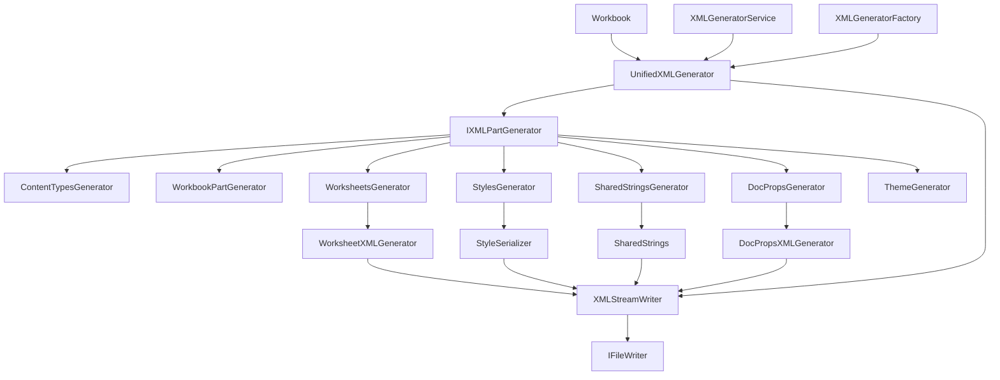
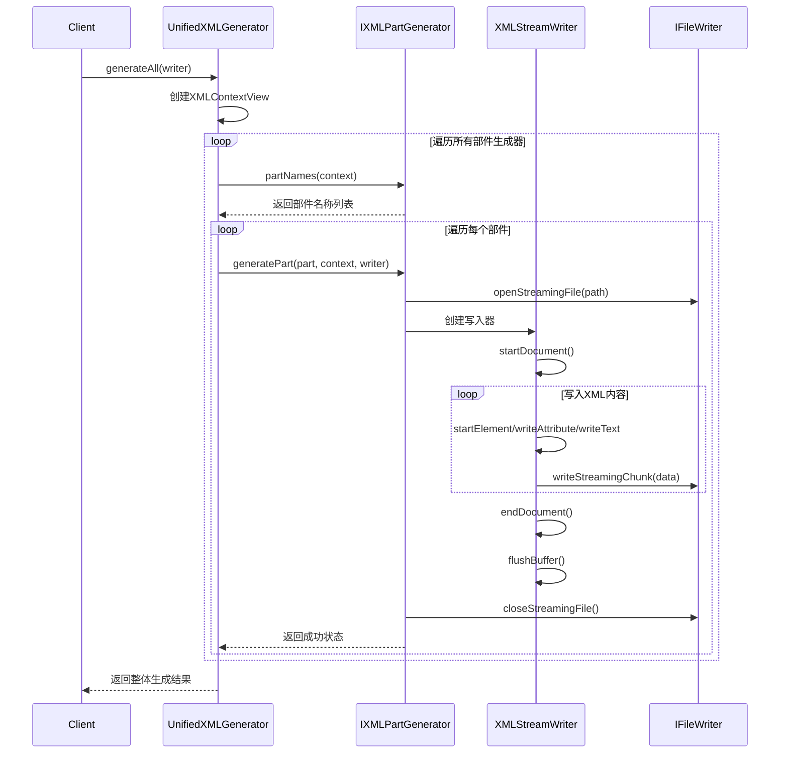
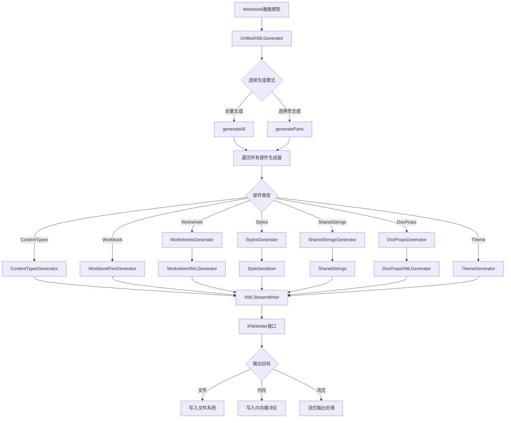
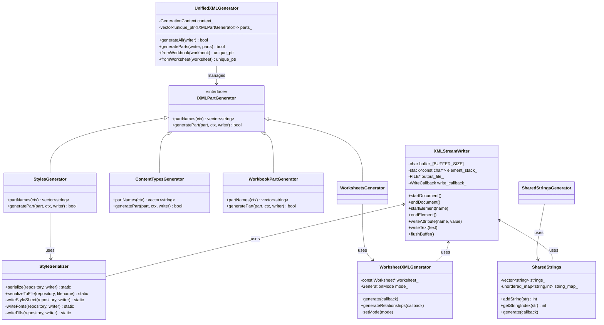

# FastExcel XML生成架构文档

## 项目概览

FastExcel是一个高性能的Excel文件读写库，采用C++编写。本文档深入分析了其XML生成子系统的架构设计、核心组件以及工作流程。

## 核心设计原则

项目严格遵循SOLID设计原则：

- **单一职责原则 (SRP)**: 每个类专注于单一的XML生成职责
- **开放封闭原则 (OCP)**: 通过接口和策略模式支持扩展
- **里氏替换原则 (LSP)**: 所有生成器都可以互相替换
- **接口隔离原则 (ISP)**: 提供精简的接口定义
- **依赖倒置原则 (DIP)**: 依赖抽象接口而非具体实现

## 整体架构图



## 核心组件详解

### 1. XMLStreamWriter - 核心XML写入器

**职责**: 提供高性能的流式XML写入功能

**设计特点**:
- 基于libxlsxwriter设计模式，专注极致性能
- 使用固定大小缓冲区(8KB)，减少动态内存分配
- 支持直接文件写入和回调写入两种模式
- 内置XML字符转义机制
- 元素栈管理，确保XML结构正确性

**关键方法**:
```cpp
class XMLStreamWriter {
    // 文档控制
    void startDocument();
    void endDocument();
    
    // 元素控制
    void startElement(const char* name);
    void endElement();
    void writeEmptyElement(const char* name);
    
    // 属性和内容
    void writeAttribute(const char* name, const char* value);
    void writeText(const char* text);
    void writeRaw(const char* data);
    
    // 输出模式
    void setDirectFileMode(FILE* file, bool take_ownership = false);
    void setCallbackMode(WriteCallback callback, bool auto_flush = true);
};
```

### 2. UnifiedXMLGenerator - 统一生成器编排者

**职责**: 作为XML生成系统的核心编排者，管理所有部件生成器

**设计模式**: 
- **策略模式**: 支持多种输出方式
- **模板方法**: 统一XML生成流程
- **组合模式**: 管理多个部件生成器

**核心流程**:
```cpp
class UnifiedXMLGenerator {
    struct GenerationContext {
        const core::Workbook* workbook = nullptr;
        const core::Worksheet* worksheet = nullptr;
        const core::FormatRepository* format_repo = nullptr;
        const core::SharedStringTable* sst = nullptr;
    };
    
    // 主要生成方法
    bool generateAll(IFileWriter& writer);
    bool generateParts(IFileWriter& writer, const std::vector<std::string>& parts);
    
    // 工厂方法
    static std::unique_ptr<UnifiedXMLGenerator> fromWorkbook(const core::Workbook* workbook);
    static std::unique_ptr<UnifiedXMLGenerator> fromWorksheet(const core::Worksheet* worksheet);
};
```

### 3. IXMLPartGenerator - 部件生成器接口

**职责**: 定义标准化的XML部件生成接口

**接口设计**:
```cpp
struct XMLContextView {
    const core::Workbook *workbook = nullptr;
    const core::FormatRepository *format_repo = nullptr;
    const core::SharedStringTable *sst = nullptr;
    const theme::Theme *theme = nullptr;
};

class IXMLPartGenerator {
    // 返回该生成器负责的包内路径
    virtual std::vector<std::string> partNames(const XMLContextView &ctx) const = 0;
    
    // 生成指定部件，写入到IFileWriter
    virtual bool generatePart(const std::string &part, const XMLContextView &ctx,
                            core::IFileWriter &writer) = 0;
};
```

### 4. 专用生成器组件

#### 4.1 WorksheetXMLGenerator - 工作表生成器
**职责**: 专门生成工作表相关的XML内容

**支持模式**:
- **批量模式**: 使用XMLStreamWriter进行高效写入
- **流式模式**: 直接字符串拼接，适用于简单场景

**生成内容**:
- 工作表视图设置
- 列信息定义
- 单元格数据
- 合并单元格信息
- 自动筛选配置
- 打印和页面设置

#### 4.2 StyleSerializer - 样式序列化器
**职责**: 将FormatRepository中的格式信息序列化为XLSX格式XML

**核心功能**:
- 数字格式处理
- 字体信息序列化
- 填充样式处理
- 边框样式处理
- 单元格样式交叉引用
- 去重优化算法

#### 4.3 SharedStrings - 共享字符串管理器
**职责**: 管理和生成共享字符串表XML

**优化特性**:
- 字符串去重算法
- O(1)查找性能
- 内存优化的存储结构

#### 4.4 DocPropsXMLGenerator - 文档属性生成器
**职责**: 生成Excel文档的元数据XML

**生成内容**:
- `docProps/core.xml`: 核心文档属性
- `docProps/app.xml`: 应用程序属性
- `docProps/custom.xml`: 自定义属性

## XML生成时序图



## 数据流程图



## 类关系图



## 关键设计模式应用

### 1. 策略模式 (Strategy Pattern)
- **应用场景**: XMLStreamWriter的输出模式选择
- **具体实现**: 
  - 直接文件写入模式
  - 回调函数写入模式
  - 缓冲区写入模式

### 2. 工厂方法模式 (Factory Method Pattern)
- **应用场景**: UnifiedXMLGenerator的创建
- **具体实现**:
  - `fromWorkbook()`: 从Workbook创建
  - `fromWorksheet()`: 从Worksheet创建
  - `XMLGeneratorFactory::createGenerator()`

### 3. 模板方法模式 (Template Method Pattern)
- **应用场景**: XML生成的通用流程
- **具体实现**: 所有生成器都遵循相同的生成流程框架

### 4. 组合模式 (Composite Pattern)
- **应用场景**: UnifiedXMLGenerator管理多个部件生成器
- **具体实现**: 统一接口处理不同类型的生成器

### 5. 接口隔离原则应用
- **IXMLPartGenerator**: 专用于部件生成
- **XMLGeneratorService**: 提供高层服务接口
- **各专用生成器**: 只暴露必需的方法

## 性能优化要点

### 1. 内存管理优化
- **固定大小缓冲区**: XMLStreamWriter使用8KB固定缓冲区，避免频繁内存分配
- **栈管理**: 使用std::stack管理XML元素嵌套，确保正确关闭
- **字符串去重**: SharedStrings使用哈希映射实现O(1)查找

### 2. I/O优化
- **流式写入**: 支持直接文件写入，减少内存拷贝
- **批量刷新**: 缓冲区达到阈值时才刷新，减少系统调用
- **回调机制**: 支持用户自定义输出处理逻辑

### 3. XML写入优化
- **预定义转义**: 使用预定义的转义字符串和长度，避免运行时计算
- **快速检查**: 在转义前快速检查是否包含需要转义的字符
- **内联处理**: 关键路径方法使用内联优化

## 使用示例

### 基础用法
```cpp
// 创建workbook
auto workbook = std::make_unique<core::Workbook>();

// 创建生成器
auto generator = UnifiedXMLGenerator::fromWorkbook(workbook.get());

// 生成所有XML文件
MyFileWriter writer("output.xlsx");
bool success = generator->generateAll(writer);
```

### 选择性生成
```cpp
// 只生成特定部件
std::vector<std::string> parts = {
    "xl/workbook.xml",
    "xl/styles.xml",
    "xl/worksheets/sheet1.xml"
};

bool success = generator->generateParts(writer, parts);
```

### 流式输出
```cpp
// 使用回调函数进行流式输出
XMLStreamWriter writer([](const char* data, size_t size) {
    // 自定义输出处理
    std::cout.write(data, size);
});

WorksheetXMLGenerator wsGenerator(worksheet.get());
wsGenerator.generate([&writer](const char* data, size_t size) {
    writer.write(data, size);
});
```

## 扩展指南

### 添加新的XML部件生成器

1. **继承IXMLPartGenerator接口**:
```cpp
class MyCustomGenerator : public IXMLPartGenerator {
public:
    std::vector<std::string> partNames(const XMLContextView& ctx) const override {
        return {"xl/custom/mypart.xml"};
    }
    
    bool generatePart(const std::string& part, const XMLContextView& ctx,
                     core::IFileWriter& writer) override {
        // 实现具体生成逻辑
        return writeWithCallback(writer, part, [&](auto& callback) {
            XMLStreamWriter w(callback);
            w.startDocument();
            // ... XML写入逻辑
            w.endDocument();
            w.flushBuffer();
        });
    }
};
```

2. **注册到UnifiedXMLGenerator**:
```cpp
void UnifiedXMLGenerator::registerDefaultParts() {
    // ... 现有注册
    parts_.push_back(std::make_unique<MyCustomGenerator>());
}
```

### 性能调优建议

1. **缓冲区大小调整**: 根据实际使用场景调整XMLStreamWriter的缓冲区大小
2. **内存池使用**: 对于大量小对象，考虑使用内存池
3. **并行生成**: 对于独立的XML部件，可以考虑并行生成
4. **增量更新**: 结合DirtyManager实现增量XML生成

## 总结

FastExcel的XML生成系统是一个设计优良的高性能组件，具有以下特点：

1. **高度模块化**: 每个组件职责单一，易于维护和扩展
2. **性能优化**: 从内存管理到I/O操作都进行了深度优化
3. **灵活配置**: 支持多种输出模式和生成策略
4. **标准兼容**: 严格遵循OOXML标准，生成标准的Excel文件
5. **易于扩展**: 通过接口和工厂模式支持新功能的添加

这个架构不仅满足了当前的功能需求，还为未来的功能扩展和性能优化提供了坚实的基础。

---

*文档版本: 1.0*  
*最后更新: 2025-01-08*  
*维护者: wuxianggujun*